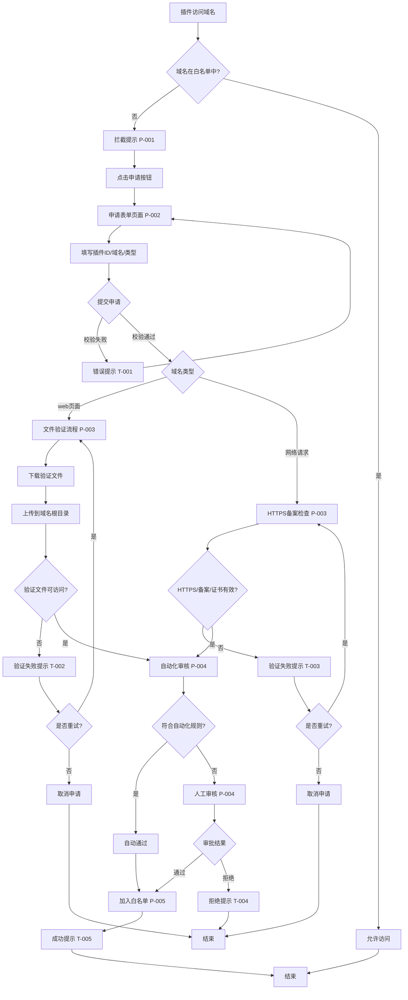

## 0. TL;DR（给评审者的 1 分钟版）

- **覆盖的核心场景数**：1（S-001）
- **最高风险/待确认 Top3**：
  1. 插件技术架构是否支持域名拦截机制（影响：AC-8 / S-001 / 节点 P-006）
  2. 插件管理对应的部门具体指哪个部门/角色（影响：AC-5 / S-001 / 节点 P-004）
  3. 自动化审核规则边界不明确（影响：AC-4 / S-001 / 节点 P-003）

---

## 1. 概述

- **目标**：将 PRD 的核心场景/用户故事/规则/异常/AC 转写为可实现、可测试的交互规格。
- **输入来源**：
  - PRD：`requirements/prd.md`
  - 澄清：`requirements/clarify.md`
  - 方案：`requirements/solutions.md`
  - 术语：`project/memory/glossary.md`（无）
- **不在本文件范围**：视觉规范、UI 样式、完整线框/可点击原型（交给 R7）。

---

## 2. 场景清单（与 PRD 对齐）

| 场景编号 | 场景标题（用户视角） | 简述 | PRD 来源（章节/用户故事） | 对应 AC |
|---|---|---|---|---|
| S-001 | 跨境电商用户申请插件域名访问权限 | 用户使用插件访问域名时触发拦截，提交申请并完成验证，经过审核后加入白名单，实现插件维度权限管理 | PRD 5.1 场景 S1 | AC-1 至 AC-10 |

---

## 3. 场景详情

> 规则：每个场景一节；流程图节点 ID 必须与"节点清单"一致（P/D/W/T-xxx）。

### 3.1 S-001 跨境电商用户申请插件域名访问权限

#### 3.1.1 情景摘要

- **场景编号**：S-001
- **触发与入口**：跨境电商用户使用浏览器扩展插件访问某个域名时，系统检测到该域名不在白名单中，触发访问前拦截，显示拦截提示页面（P-001）
- **前置条件**：
  - 用户已登录插件管理平台（待确认：是否需要登录，登录方式）
  - 用户已安装并使用浏览器扩展插件
  - 插件尝试访问的域名不在白名单中
- **情景描述**：
  - **触发条件**：用户使用浏览器扩展插件访问某个域名，系统检测到该域名不在白名单中
  - **目标**：获得插件访问指定域名的权限，使插件能够正常访问该域名
  - **成功标准**：该插件+域名的组合被加入白名单，配置在5分钟内生效，所有使用该插件的用户都可以正常访问该域名，无需重复申请
- **痛点**：
  - P1：当前按用户维度审核，导致同一插件的域名访问需要每个用户重复申请，效率低下
  - P2：管理分散，无法统一管控插件域名访问权限
- **快点**：
  - H1：插件维度的统一审核，一次申请即可覆盖所有使用该插件的用户
  - H2：集中管理，审核流程清晰高效
- **来源**：clarify.md S1 / PRD 5.1 场景 S1

#### 3.1.2 端到端任务流（Mermaid）

#### 3.1.3 节点清单（Node Inventory）

> 编号建议：页面 P-xxx；弹窗 D-xxx；抽屉 W-xxx；提示/反馈 T-xxx。

| Node ID | 类型（P/D/W/T） | 名称/目的 | 入口（从哪里来） | 关键区块（展示/输入/操作） | 关键控件与规则（含默认值/禁用条件/提交条件） | 跳转（成功/失败/取消/关闭） |
|---|---|---|---|---|---|---|
| P-001 | P | 拦截提示页面 | 插件访问域名时触发拦截 | 拦截提示信息、申请按钮、取消按钮 | 申请按钮：默认可用；取消按钮：默认可用 | 点击申请→P-002；点击取消→关闭页面 |
| P-002 | P | 申请表单页面 | P-001 点击申请按钮 | 插件ID输入框、域名输入框、域名类型选择、提交按钮、取消按钮 | 插件ID：必填，格式校验（待确认格式规则）；域名：必填，格式校验（域名格式）；域名类型：必填，默认"网络请求"（web页面/网络请求）；提交按钮：表单校验通过后可用；取消按钮：默认可用 | 提交成功→P-003；取消→返回 P-001 |
| P-003 | P | 域名验证页面 | P-002 提交申请后 | web页面类型：验证文件下载链接、上传指引、验证按钮、重试按钮；网络请求类型：HTTPS检查结果、备案检查结果、证书检查结果、验证按钮、重试按钮 | 验证按钮：验证中禁用，防止重复提交；重试按钮：验证失败后可用；取消按钮：默认可用 | 验证成功→P-004；验证失败→显示错误提示，可重试；取消→返回 P-002 |
| P-004 | P | 审核处理页面 | P-003 验证通过后 | 自动化审核结果展示、人工审核状态展示、审核进度、审核结果 | 自动化审核：自动执行，无需用户操作；人工审核：仅审批人可见（待确认权限），显示审核中状态 | 自动化通过→P-005；人工审核通过→P-005；人工审核拒绝→T-004 |
| P-005 | P | 白名单生效页面 | P-004 审核通过后 | 白名单生效提示、生效倒计时、完成按钮 | 完成按钮：默认可用 | 点击完成→T-005 |
| P-006 | P | 域名拦截检查（插件端） | 插件访问域名时 | 白名单检查逻辑（后台，用户不可见） | 检查逻辑：访问前检查白名单，未在白名单中则拦截 | 在白名单中→允许访问；不在白名单中→P-001 |
| D-001 | D | 二次确认弹窗（高风险操作） | P-002 提交申请前（待确认是否需要） | 确认提示信息、确认按钮、取消按钮 | 确认按钮：默认可用；取消按钮：默认可用 | 确认→提交申请；取消→关闭弹窗 |
| T-001 | T | 表单校验错误提示 | P-002 提交时校验失败 | 错误提示信息 | 位置：表单字段下方或页面顶部；文案：根据校验规则显示具体错误 | 用户修改后自动消失 |
| T-002 | T | 文件验证失败提示 | P-003 文件验证失败 | 错误提示信息、解决建议 | 位置：验证结果区域；文案：提示文件不可访问，建议检查上传路径和可访问性 | 显示重试按钮，可重新验证 |
| T-003 | T | HTTPS备案检查失败提示 | P-003 HTTPS备案检查失败 | 错误提示信息、解决建议 | 位置：验证结果区域；文案：提示HTTPS证书无效或备案未完成，建议配置有效证书或完成备案（新备案域名需等待24小时） | 显示重试按钮，可重新验证 |
| T-004 | T | 审核拒绝提示 | P-004 人工审核拒绝 | 拒绝原因、重新申请按钮 | 位置：审核结果页面；文案：显示拒绝原因（待确认是否提供拒绝原因） | 可重新申请→P-002 |
| T-005 | T | 申请成功提示 | P-005 白名单生效后 | 成功提示信息、生效时间 | 位置：页面顶部或弹窗；文案：提示申请成功，白名单将在5分钟内生效 | 自动关闭或手动关闭 |

#### 3.1.4 状态覆盖与反馈（至少：正常/加载/空/错/无权限）

| 节点 | 正常态 | 加载态（首屏/提交中/分页等） | 空态（无数据/无结果） | 错误态（网络/服务端/业务校验） | 无权限（不可见/只读/禁用） |
|---|---|---|---|---|---|
| P-001 | 显示拦截提示和申请按钮 | 拦截检查中显示加载动画 | 无 | 拦截检查失败显示错误提示，允许重试 | 无 |
| P-002 | 显示申请表单，所有字段可编辑 | 提交中显示加载动画，提交按钮禁用 | 无 | 提交失败显示错误提示（T-001），保留用户输入 | 无 |
| P-003 | 显示验证指引和验证按钮 | 验证中显示加载动画，验证按钮禁用 | 无 | 验证失败显示错误提示（T-002/T-003），允许重试 | 无 |
| P-004 | 显示审核状态和结果 | 自动化审核中显示加载动画；人工审核中显示审核中状态 | 无审核记录（首次申请） | 审核失败显示错误提示，允许重新申请 | 非审批人仅可见审核状态，不可操作（待确认权限） |
| P-005 | 显示白名单生效提示 | 生效中显示倒计时 | 无 | 生效失败显示错误提示，允许重试 | 无 |
| P-006 | 白名单检查正常执行 | 检查中（后台，用户不可见） | 无 | 检查失败记录日志，告警通知运营团队 | 无 |
| D-001 | 显示确认提示和按钮 | 无 | 无 | 无 | 无 |
| T-001 | 显示错误提示 | 无 | 无 | 无 | 无 |
| T-002 | 显示错误提示和重试按钮 | 无 | 无 | 无 | 无 |
| T-003 | 显示错误提示和重试按钮 | 无 | 无 | 无 | 无 |
| T-004 | 显示拒绝提示和重新申请按钮 | 无 | 无 | 无 | 无 |
| T-005 | 显示成功提示 | 无 | 无 | 无 | 无 |

#### 3.1.5 关键交互细节（校验规则/提示文案/高风险二次确认）

- **校验规则**（按"条件 + 规则 + 反馈位置 + 文案建议"写）：
  - 规则-1：插件ID必填；格式校验（待确认格式规则，如：长度限制、字符限制）；反馈位置：插件ID输入框下方；文案建议："请输入插件ID"（空值）、"插件ID格式不正确"（格式错误）
  - 规则-2：域名必填；域名格式校验（符合域名格式规范，如：包含点号、有效字符）；反馈位置：域名输入框下方；文案建议："请输入域名"（空值）、"域名格式不正确，请输入有效域名"（格式错误）
  - 规则-3：域名类型必填；默认值：网络请求；反馈位置：域名类型选择区域；文案建议：无需提示（有默认值）
  - 规则-4：文件验证文件可访问性；文件必须可访问（HTTP 200状态码）；反馈位置：验证结果区域；文案建议："文件验证失败，请检查文件是否已上传到域名根目录且可访问"（失败）
  - 规则-5：HTTPS协议检查；域名必须启用HTTPS协议；反馈位置：验证结果区域；文案建议："域名未启用HTTPS协议，请配置有效的HTTPS证书"（失败）
  - 规则-6：域名备案检查（如需要）；域名必须已备案（待确认是否所有网络请求域名都需要备案）；反馈位置：验证结果区域；文案建议："域名未完成备案，请完成备案后重新申请（新备案域名需等待24小时）"（失败）
  - 规则-7：证书有效性检查；HTTPS证书必须有效；反馈位置：验证结果区域；文案建议："HTTPS证书无效，请配置有效的证书"（失败）
  - 规则-8：幂等性检查；同一插件+域名的重复申请应进行幂等处理；反馈位置：提交时；文案建议："该插件+域名组合已存在申请记录，请勿重复提交"（重复申请）
- **失败处理**：
  - 可重试：是；策略：文件验证失败和HTTPS备案检查失败支持重试，显示重试按钮，用户可重新验证；表单提交失败保留用户输入，允许修改后重新提交
  - 是否保存草稿：待确认；策略：待确认是否需要保存草稿功能
- **高风险操作（如删除/不可逆提交/审批通过等）**：
  - 风险提示：提交申请后进入审核流程，审核通过后白名单生效，影响所有使用该插件的用户；审核拒绝后需要重新申请
  - 二次确认：待确认；确认方式：待确认是否需要二次确认弹窗（D-001）；文案：待确认；默认按钮：待确认
  - 说明：PRD 未明确定义二次确认策略，建议在提交申请前增加二次确认弹窗，提示用户申请的影响范围（插件维度，影响所有用户），标注"待确认"并说明影响：影响用户体验和审核流程设计

#### 3.1.6 对应 AC（本场景覆盖）

- AC-1：用户提交域名访问申请时，能够成功填写插件ID、域名信息、域名类型（web页面/网络请求），申请提交成功率 >95%（节点：P-002，验证点：表单字段完整、校验规则正确、提交成功）
- AC-2：web页面类型的域名验证时，系统能够生成验证文件（如 verify_xxxxxx.txt），用户能够下载并上传到域名根目录，系统能够验证文件可访问性，文件验证通过率 >80%（节点：P-003，验证点：验证文件生成、下载功能、上传指引、验证逻辑）
- AC-3：网络请求类型的域名验证时，系统能够检查域名是否启用HTTPS协议、是否已备案（如需要）、证书是否有效，HTTPS备案检查通过率 >70%（节点：P-003，验证点：HTTPS检查、备案检查、证书检查）
- AC-4：自动化审核时，系统能够根据预设规则（已知安全域名列表、域名格式校验、HTTPS证书有效性等）判断是否可自动通过，自动化审核率 >30%（节点：P-004，验证点：自动化规则执行、审核结果判断）
- AC-5：人工审核时，不符合自动化规则的申请能够流转到插件管理对应的部门进行人工审批，人工审批平均时长 <24 小时（待确认 Q6）（节点：P-004，验证点：人工审核流转、审批人权限、审批时效）
- AC-6：审核通过后，该插件+域名的组合能够被加入白名单，配置在5分钟内生效，白名单生效率 100%（节点：P-005，验证点：白名单加入逻辑、生效时间）
- AC-7：白名单生效后，所有使用该插件的用户都能够正常访问该域名，无需重复申请（节点：P-005/P-006，验证点：白名单生效后插件访问检查）
- AC-8：插件访问域名时，系统能够在访问前检查白名单，未在白名单中的域名请求被拦截，拦截准确率 100%（节点：P-006，验证点：访问前拦截检查、拦截逻辑）
- AC-9：所有关键操作（申请提交、验证结果、审核操作、白名单变更、拦截事件）都有审批日志记录，审批日志完整性 100%（节点：所有节点，验证点：日志记录完整性，后台实现）
- AC-10：同一插件+域名的重复申请能够进行幂等处理，避免重复审核（节点：P-002，验证点：幂等性检查）

---

## 4. AC → 交互节点映射表（必须）

| AC-ID / 描述 | 场景 | 节点（P/D/W/T-xxx） | 验证点（状态/文案/按钮可用性/跳转结果） |
|---|---|---|---|
| AC-1：用户提交域名访问申请时，能够成功填写插件ID、域名信息、域名类型 | S-001 | P-002 | 正常态：表单字段可编辑，提交按钮可用；错误态：校验失败显示错误提示（T-001），提交按钮禁用；成功：跳转到 P-003 |
| AC-2：web页面类型的域名验证时，系统能够生成验证文件，用户能够下载并上传，系统能够验证文件可访问性 | S-001 | P-003 | 正常态：显示验证文件下载链接和上传指引，验证按钮可用；加载态：验证中显示加载动画，验证按钮禁用；错误态：验证失败显示错误提示（T-002），重试按钮可用；成功：跳转到 P-004 |
| AC-3：网络请求类型的域名验证时，系统能够检查域名是否启用HTTPS协议、是否已备案、证书是否有效 | S-001 | P-003 | 正常态：显示HTTPS/备案/证书检查结果，验证按钮可用；加载态：验证中显示加载动画，验证按钮禁用；错误态：验证失败显示错误提示（T-003），重试按钮可用；成功：跳转到 P-004 |
| AC-4：自动化审核时，系统能够根据预设规则判断是否可自动通过 | S-001 | P-004 | 正常态：显示自动化审核结果；加载态：自动化审核中显示加载动画；成功：自动化通过跳转到 P-005；失败：流转到人工审核 |
| AC-5：人工审核时，不符合自动化规则的申请能够流转到插件管理对应的部门进行人工审批 | S-001 | P-004 | 正常态：显示人工审核状态（审核中/已通过/已拒绝）；加载态：审核中显示审核中状态；成功：审核通过跳转到 P-005；失败：审核拒绝显示拒绝提示（T-004） |
| AC-6：审核通过后，该插件+域名的组合能够被加入白名单，配置在5分钟内生效 | S-001 | P-005 | 正常态：显示白名单生效提示和生效倒计时；加载态：生效中显示倒计时；成功：显示成功提示（T-005） |
| AC-7：白名单生效后，所有使用该插件的用户都能够正常访问该域名，无需重复申请 | S-001 | P-005/P-006 | 正常态：白名单生效后，P-006 检查通过，允许访问；验证点：其他用户使用同一插件访问同一域名时，P-006 检查通过，无需再次申请 |
| AC-8：插件访问域名时，系统能够在访问前检查白名单，未在白名单中的域名请求被拦截 | S-001 | P-006 | 正常态：访问前检查白名单，未在白名单中则拦截，跳转到 P-001；在白名单中则允许访问；验证点：拦截准确率 100% |
| AC-9：所有关键操作都有审批日志记录 | S-001 | 所有节点（后台实现） | 验证点：申请提交、验证结果、审核操作、白名单变更、拦截事件都有日志记录，日志完整性 100%（后台验证） |
| AC-10：同一插件+域名的重复申请能够进行幂等处理 | S-001 | P-002 | 正常态：提交时检查是否重复申请；错误态：重复申请显示错误提示，不允许提交；验证点：幂等性检查逻辑正确 |

---

## 5. 关键规则/异常 → 节点状态映射（可选但推荐）

| 规则/异常 | 触发条件 | 受影响节点 | 期望反馈（位置/文案/动作） |
|---|---|---|---|
| 规则-1：插件维度管理 | 一次审核通过后，所有使用该插件的用户都可以访问该域名 | P-005/P-006 | 位置：白名单生效提示；文案：提示"该插件+域名组合已加入白名单，所有使用该插件的用户都可以正常访问"；动作：白名单生效后，P-006 检查通过 |
| 规则-2：域名类型区分 | web页面采用文件验证，网络请求需要HTTPS和备案 | P-003 | 位置：域名验证页面；文案：根据域名类型显示不同的验证指引；动作：web页面显示文件验证流程，网络请求显示HTTPS备案检查 |
| 规则-3：访问前拦截 | 未在白名单中的域名必须被拦截 | P-006 | 位置：插件访问域名时（后台）；文案：拦截后跳转到 P-001 显示拦截提示；动作：未在白名单中则拦截，跳转到 P-001 |
| 规则-4：混合审核模式 | 优先自动化审核，不符合自动化规则的申请需要人工审批 | P-004 | 位置：审核处理页面；文案：显示自动化审核结果，如不符合则显示人工审核状态；动作：自动化通过直接生效，不符合则流转到人工审核 |
| 规则-5：白名单生效时间 | 白名单配置在5分钟内生效 | P-005 | 位置：白名单生效页面；文案：显示生效倒计时；动作：5分钟内生效 |
| 规则-6：域名备案等待时间 | 新备案域名需等待24小时后才能配置 | P-003 | 位置：HTTPS备案检查失败提示；文案：提示"新备案域名需等待24小时后才能配置"；动作：备案未完成则验证失败，显示等待提示 |
| 规则-7：文件验证要求 | 文件验证文件必须可访问 | P-003 | 位置：文件验证结果；文案：验证失败提示"文件验证失败，请检查文件是否已上传到域名根目录且可访问"；动作：文件不可访问则验证失败，允许重试 |
| 异常-1：文件验证失败 | 文件不可访问或上传路径错误 | P-003 | 位置：验证结果区域；文案：显示错误提示（T-002）和解决建议；动作：显示重试按钮，允许重新验证 |
| 异常-2：HTTPS证书无效 | HTTPS证书无效或未配置 | P-003 | 位置：验证结果区域；文案：显示错误提示（T-003）"HTTPS证书无效，请配置有效的证书"；动作：显示重试按钮，允许重新验证 |
| 异常-3：域名备案未完成 | 域名未完成备案或新备案域名未等待24小时 | P-003 | 位置：验证结果区域；文案：显示错误提示（T-003）"域名未完成备案，请完成备案后重新申请（新备案域名需等待24小时）"；动作：显示重试按钮，允许重新验证 |
| 异常-4：自动化规则匹配失败 | 不符合自动化规则 | P-004 | 位置：审核处理页面；文案：显示"不符合自动化规则，已流转到人工审核"；动作：自动流转到人工审核 |
| 异常-5：拦截机制失效 | 拦截机制异常或白名单检查失败 | P-006 | 位置：后台；文案：记录异常日志，告警通知运营团队；动作：记录日志，发送告警 |
| 异常-6：白名单数据准确性风险 | 白名单数据错误或格式不正确 | P-005 | 位置：后台；文案：建立白名单数据校验机制；动作：审批流程中增加域名格式校验和安全性检查 |
| 异常-7：并发申请处理 | 多个用户同时提交申请 | P-002 | 位置：后台；文案：系统需支持并发申请处理；动作：并发处理逻辑（待确认性能要求 Q7） |
| 异常-8：幂等性 | 同一插件+域名的重复申请 | P-002 | 位置：提交时；文案：显示"该插件+域名组合已存在申请记录，请勿重复提交"；动作：不允许重复提交 |

---

## 6. 追溯链接（Evidence & References）

- PRD：`requirements/prd.md`（第5.1节场景S1、第9.1节AC-1至AC-10、第6节业务规则、第8节异常与边界）
- 澄清：`requirements/clarify.md`（第3节场景S1、第4节痛点总结、第6节范围边界）
- 方案：`requirements/solutions.md`（第3.3节用户旅程/主流程、第3.4节关键规则/状态/异常）
- 原型（R7）：`requirements/prototype.md`（如有）

---

## 7. R6-DoD 自检（完成标准）

- [x] 场景清单与 PRD 核心场景/AC 一一对应（可追溯）
  - S-001 对应 PRD 5.1 场景 S1，覆盖 AC-1 至 AC-10
- [x] 每个核心场景至少 1 张端到端任务流（含关键分支/异常/回退）
  - S-001 包含完整任务流，覆盖验证分支（web页面/网络请求）、审核分支（自动化/人工）、异常处理（验证失败、审核拒绝）、回退（取消、重试）
- [x] 节点清单完整，且流程图节点 ID 与清单一致
  - 节点清单包含 P-001 至 P-006、D-001、T-001 至 T-005，与流程图节点 ID 一致
- [x] 状态覆盖完整（至少空/加载/错误/权限不足）；高风险操作含二次确认/提示策略（未知则标注待确认）
  - 状态覆盖表包含正常/加载/空/错/无权限；高风险操作（提交申请）标注"待确认"是否需要二次确认
- [x] 每个核心场景至少 1 个痛点与 1 个快点，并在交互节点中体现设计策略
  - S-001 包含痛点 P1/P2 和快点 H1/H2，设计策略体现在插件维度管理（P-005/P-006）、集中审核流程（P-004）
- [x] 存在 AC → 交互节点映射表，能明确"在哪验证哪条 AC"
  - AC 映射表完整，包含 AC-1 至 AC-10 的节点映射和验证点

---

## 8. 待确认/需补齐（不超过 3 个优先问题）

- **问题 1**：插件技术架构是否支持域名拦截机制？（影响：AC-8 / S-001 / 节点 P-006；建议取证：技术预研 PoC，验证插件 SDK 集成可行性）
- **问题 2**：插件管理对应的部门具体指哪个部门/角色？审批人权限如何定义？（影响：AC-5 / S-001 / 节点 P-004；建议取证：向业务方/产品负责人确认）
- **问题 3**：提交申请是否需要二次确认？如果需要，确认方式和文案是什么？（影响：用户体验和审核流程设计；建议取证：向产品负责人确认）
