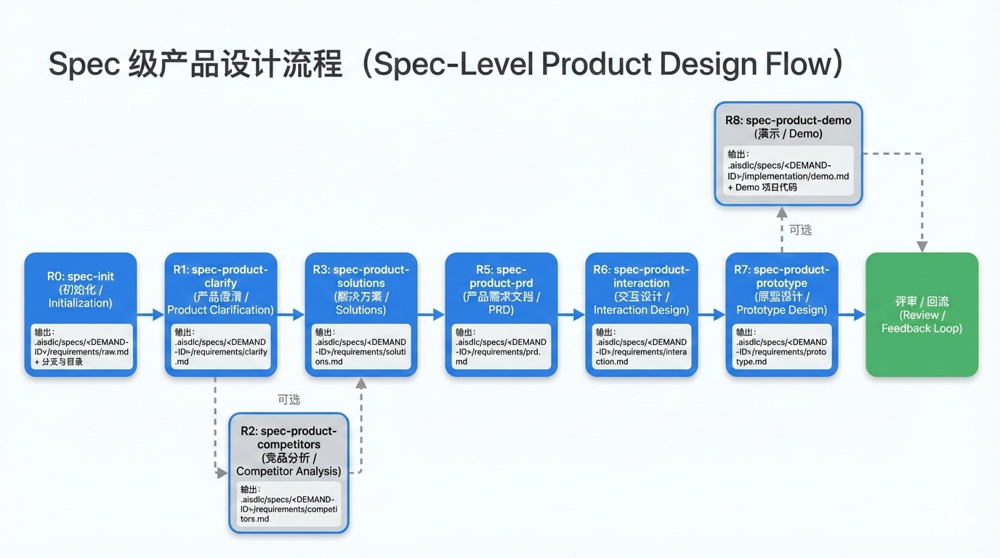

---
markdown-sharing:
  uri: 090998fa-c053-4400-8c18-27581d8c17b7
---

# AI SDLC 项目思路与进展汇报（2026-02-09）

> 汇报范围：聚焦 `design/` 目录下已沉淀的设计方案与阶段性进展（方法论、信息架构、落盘规范、需求分析阶段 AI 提效流程等）。  

## 1. 项目背景与要解决的问题

公司推动研发新范式升级，希望把“知识组织方式”和“研发过程方法论”工程化、标准化，并借助 AI 实现稳定提效与持续演进。本项目聚焦两个核心痛点：

- **知识分散、上下文丢失**：需求/设计/契约/运维信息散落在多处，跨角色协作成本高，容易返工。
- **AI 提效不稳定**：AI 在不同阶段“读什么/写什么/怎么验收”缺乏统一约束，导致输出口径漂移、可追溯性弱。

## 2. 总体目标（北极星）

- **建立 AI SDLC 项目知识库**：形成可持续维护的项目级知识资产（长期事实源），支持检索、引用与追溯。
- **建立各节点 SOP，并在各阶段用 AI 辅助提效**：把每一步的输入/输出/门禁/证据固化为工作流与模板，让最佳实践成为默认路径。

## 3. 核心思路（方法论总览）

项目总体设计围绕 5 个关键理念展开（详见 `design/aisdlc.md`）：

### 3.1 双层 SSOT：项目级 SSOT + 需求级 Spec Pack

- **项目级 SSOT（长期资产）**：稳定、可治理、可复用的“项目事实源”，服务于跨需求、跨阶段的长期演进。
- **需求级 Spec Pack（交付闭环）**：每个需求独立的规格与证据包，覆盖从 PRD 到发布再到归档的闭环产物；需求完成后通过 **Merge-back** 机制把可复用内容晋升回项目级。

### 3.2 Spec as Code

把 Spec 文档当作代码对待：版本控制、评审、随实现演进，减少“文档过时/口径不一致”的系统性风险。

### 3.3 渐进式披露（Progressive Disclosure）

Agent 默认先读 **项目级地图与规范**（“先看地图”），只有在任务明确指向某个需求时才按需读取该需求的 Spec Pack（“再按需取证”），避免上下文噪音和跨需求污染。

### 3.4 SOP = 工作流 + 模板 + 门禁

- **工作流**：定义每一步“读什么/写什么/如何验收/证据是什么”。
- **模板**：固化产物骨架（Frontmatter + 最小闭环正文结构）。
- **门禁**：DoR/DoD、结构完整性、引用/追溯、契约/测试/发布校验等。

### 3.5 Merge-back：把短期交付变长期资产

需求完成不是“文档全拷贝回项目层”，而是按资产类型筛选晋升（ADR、契约、运维资产、NFR 基线等），其余作为交付证据归档，支持审计与复盘。

## 4. 整体设计（信息架构与落盘形态）

### 4.1 顶层信息分层与读取顺序

- **项目级 Memory（宪法/全局上下文）**：业务、技术、结构、术语等全局约束与入口。
- **项目级地图层（Index/Registry）**：索引与导航入口（组件/业务模块/契约/ADR 等）。
- **需求级 Spec Pack（按需加载）**：围绕单需求交付闭环的规格与证据。
- **交付物层（代码/测试/运维）**：与 Spec 互相追溯链接。

建议读取顺序（面向 Agent）：先项目级 `memory/` 与索引 → 再按需读取某个 `specs/<DEMAND-ID>/` → 回写产物并在 Merge-back 晋升可复用资产。

### 4.2 目录结构约定（可直接落地）

核心结构为：

- `.aisdlc/project/`：项目级 SSOT（长期资产：Memory / ADR / Contracts / Products / Components / Ops / NFR / Registry）
- `.aisdlc/specs/<DEMAND-ID>/`：需求级 Spec Pack（交付闭环：requirements/design/implementation/verification/release/merge_back）

### 4.3 需求级 Spec Pack 的 7 阶段闭环（顶层规划）

需求级 Spec Pack 定义 7 个阶段的最小核心输出：产品需求、重构需求（可选）、需求设计、需求实现、需求测试、发布、Merge-back（归档与晋升）。

### 4.4 原子 Spec 规范（让 AI 读得准、写得对）

- **YAML Frontmatter**：用于索引、依赖、追溯（id、stage、status、depends_on、related_code/tests 等）。
- **最小闭环正文结构**：背景与目标、范围、流程（Mermaid）、规则与边界、契约/数据、验收标准、追溯链接。

### 4.5 业务架构与应用架构的长期资产化

项目级按企业架构分层沉淀：

- **业务模块（`project/products/`）**：业务边界、能力、流程、业务对象/事件、规则与口径、指标与依赖（强调业务语义，不写实现细节）。
- **应用组件（`project/components/`）**：组件边界与承诺、应用服务目录、接口与契约入口、协作关系、数据对象责任、NFR 分摊与运行入口（强调应用层协作边界，不写一次性交付细节）。

## 5. 专项示例

### 5.1 “Discover（逆向）↔ Design（正向）”的统一产物框架

在遵循双层 SSOT 与渐进式披露的前提下，已整理出“从设计资产出发的正向工程”方案（详见 `design/aisdlc_project_discover.md`）：

- **Discover（逆向）**：面向存量项目，从仓库事实反推项目级资产。
- **Design（正向）**：面向绿地/重构/新增模块，先沉淀项目级地图层与契约（ADR/Contracts），再驱动需求级 Spec Pack 与实现，最终 Merge-back 补齐实现证据入口。

该对照为后续“存量治理”和“新建项目落地”提供一致的产物结构与治理方式。

### 5.2 Spec 级“产品需求开发阶段”AI 提效方案（R0-R8）

针对产品需求开发阶段，已形成一套可分布、可替换、可评审的模块化流水线（详见 `design/aisdlc_spec_product.md`）：

- **R0 Spec 初始化**：创建规范分支与 Spec Pack，落盘 `requirements/raw.md` 作为证据入口。
- **R1 需求澄清**：输出 `clarify.md`（目标/用户/场景/边界/约束/待确认问题），支持“交互式补充 + 增量写回 raw.md”保证可追溯。
- **R2 竞品/替代方案分析（可选）**：拆解竞品形成“功能池/机制池”，为方案细化提供可复用输入。
- **R3 最终方案完善与迭代**：产出 `solutions.md`（结构化方案 + 覆盖校验 + 风险与验证 + 迭代记录），强制门禁：必须先拿到用户方案描述。
- **R5 PRD 生成**：产出可评审、可验收、可拆解的 `prd.md`（含 AC）。
- **R6 场景交互方案**：输出 `interaction.md`（任务流、页面结构、异常与状态、AC → 节点映射）。
- **R7 原型（线框/文本原型）**：输出 `prototype.md`，强调页面编号稳定、状态机可测试、AC 可追溯、并包含最小可用性验证与回流指引。
- **R8 前端 DEMO（可选）**：基于原型生成可运行页面用于走查对齐，定位为 DEMO（非生产实现），要求可追溯、可隔离、可回滚。

### 5.3 Spec 级“重构阶段（Refactor）”SOP（R0-R2：澄清 + 基线）

补齐“重构类需求”的前置输入与门禁（详见 `design/aisdlc_spec_refactor.md`），核心是用最小闭环防止重构失控：

- **R1 重构澄清**：输出 `refactors/clarify.md`，强制写清 **不变量（Must Not Change）** 与 **允许变化点（May Change）**，并冻结 In/Out。
- **R2 现状与基线**：输出 `refactors/baseline.md`，至少给出 **1 个可验证基线**、回滚/止损初稿，并在文末给出“进入设计阶段（Design）的 DoR 清单”。

> 说明：Refactor 块只回答“做什么/哪些必须不变/如何度量现状”，后续 design/implementation/verification/release 复用通用阶段 SOP。

### 5.4 Spec 级“设计阶段”SOP（D1 可选 / D2 必做 / D3 可选）

沉淀需求/重构通用的设计阶段 SOP（详见 `design/aisdlc_spec_design.md`），以 **D2 概要设计**为必做核心：

- **D1 大纲与研究（可选）**：输出 `design/research.md`，收敛现状、约束、风险与未知项（统一标注 `NEEDS CLARIFICATION`），为 D2 提供输入。
- **D2 概要设计（必做）**：输出 `design/solution.md`，覆盖方案边界、核心流程（Mermaid）、关键权衡与风险/验证计划；必要时引入 ADR。
- **D3 详细设计、契约（可选）**：输出 `design/data-model.md`、`design/contracts/`、`design/detail.md`，把概要方案下沉到可实现与可契约化粒度。

### 5.5 Spec 级“实现阶段”SOP（I1/I2/I3：计划 / 任务分解 / 执行）

沉淀实现阶段通用 SOP（详见 `design/aisdlc_spec_implementation.md`），把“怎么做”落到可执行且可审计的交付清单：

- **I1 实现计划（必做）**：输出 `implementation/plan.md`，对齐范围/里程碑/依赖/风险/验收口径，并显式列出 `NEEDS CLARIFICATION`。
- **I2 任务分解（必做）**：输出 `implementation/tasks.md`，形成可执行、可并行、可追溯的任务清单（任务 → Spec 输入 → 交付物/验收点）。
- **I3 执行（必做）**：解析并执行 `tasks.md` 全量任务，逐条回写完成状态，并补充最小可审计信息（提交/PR/变更路径）。

> 关键约束：实现阶段产生的决策与契约变更，优先在 **Spec 目录内**草拟，待 merge-back 再晋升到 `project/`，避免交付过程中直接污染项目级长期资产。

## 7. 当前进展（截至 2026-02-09）

### 7.1 已完成/已沉淀的关键文档

- `design/aisdlc.md`：项目总方案（双层 SSOT、渐进式披露、目录结构、7 阶段闭环、Merge-back、原子 Spec 规范、业务/应用架构资产化）。
- `design/aisdlc_project_discover.md`：Discover ↔ Design 的反向对照与正向落地节奏（Level-0/Level-1 资产的构建顺序与质量门槛）。
- `design/aisdlc_spec_product.md`：Spec 级产品需求开发端到端流程（R0-R8）、落盘结构、读取顺序、门禁与 DoD。
- `design/aisdlc_spec_refactor.md`：Spec 级重构阶段 SOP（R0-R2：澄清 + 基线），强调不变量/允许变化点、基线度量、回滚止损与进入 Design 的 DoR。
- `design/aisdlc_spec_design.md`：Spec 级设计阶段 SOP（D1 可选 / D2 必做 / D3 可选），以概要设计为核心，按需下沉到详细设计与契约。
- `design/aisdlc_spec_implementation.md`：Spec 级实现阶段 SOP（I1/I2/I3：计划/任务分解/执行），强调任务清单驱动、状态回写与可审计闭环。

## 7.2 实施情况

- **试点落地**：已在开放平台生态中心试点落地 **2 个产品需求** 的端到端开发流程（按 Spec Pack 产物落盘与门禁执行）。
- **其他试点**:
  * 云资源模块重构：SDD试用，项目逆向
  * 店铺环境模块重构：SDD试用，项目逆向
  * 效能工具：项目逆向，需求+设计+实现，Merge-back
- **阶段结论**：流程可跑通、产物可沉淀；现阶段主要工作重心从“方法论与模板”转向“阶段 SOP 补齐 + 可量化度量 + 持续推广”。

### 7.3 待办与补齐项（面向落地闭环）

- **测试阶段 SOP（Verification）**：补齐测试计划/用例/报告的落盘规范、门禁与追溯（AC → 用例 → 报告）。
- **运维/发布阶段 SOP（Release/Ops）**：补齐发布计划、Runbook、监控告警、回滚方案的落盘规范与门禁。
- **Merge-back 机制落地**：形成可执行清单与证据入口，支持 ADR/Contracts/Ops/NFR 等资产晋升到项目级 SSOT。
- **提效指标体系**：定义可量化指标与采集口径（效率/返工/一致性/可追溯性等），用于评估试点与推广效果。

### 7.4 流程验证与落地路径（覆盖典型场景）

- **项目逆向（Discover）**：面向存量项目，验证 Level-0/Level-1 资产的构建与回填路径可执行。
- **重构流程**：面向云资源、店铺环境等重构场景，验证“不变量/允许变化点/基线/回滚止损/DoR”是否能稳定收口。
- **无产品开发流程（效能工具类）**：验证在缺少完整产品链路输入时，小需求可用最小输入跑通 D2/I1 的“直达路径”。
- **小需求快速迭代流程**：验证短路径下的门禁策略、产物最小集与追溯要求，确保“快”不牺牲可审计与一致性。

