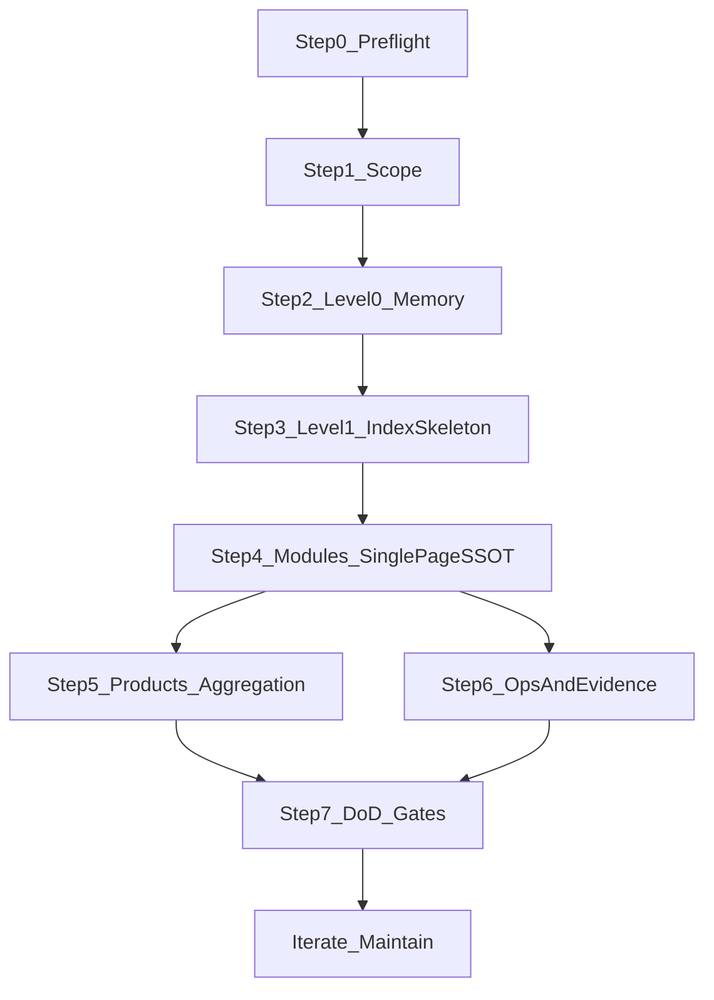
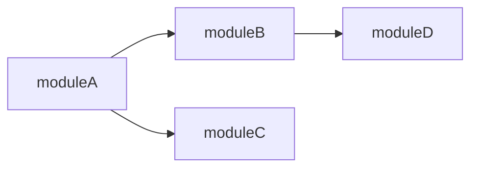

---
markdown-sharing:
  uri: 9d3f0083-b31b-4525-a493-fd9105927981
---

# AI SDLC：存量项目 Discover（逆向）SOP —— 从代码反向产出项目知识库

> 本文是**项目知识库建设的设计指南（逆向工程版）**：面向“已有代码的存量项目”，用一套可执行的 SOP，把仓库事实（代码/配置/CI/契约/运行入口）反向沉淀为 `.aisdlc/project/` 项目级 SSOT。
> 重点不是“把代码翻译成文档”，而是建立**地图层 + 权威入口 + 证据链**，让后续 AI 辅助开发更稳定、更少猜测、更可追溯。

---

## 0. 你会得到什么（收益）与不做什么（止损线）

### 0.1 主要收益（面向 AI + 面向协作）

- **减少 AI 的“猜边界/猜入口”**：项目级地图层把“哪里是权威、从哪里进、边界在哪”固定下来。
- **减少重复扫描与上下文浪费**：索引只做导航，细节按需进入模块页（包含 API/Data 契约段落）。
- **提升一致性与可追溯**：把 API/Data 契约、关键决策（ADR）、运行入口（ops）变成可链接的证据链。
- **降低返工**：当发生变更/故障/对接时，能快速定位“该看哪里、该改哪里、如何验证”。

### 0.2 非目标（避免维护成本爆炸）

- 不追求“全量字段级数据字典”；除非合规/对账/KPI 口径治理需要，否则只做**权威入口页 + 不变量摘要 + 证据链接**。
- 不把需求级一次性交付细节写进项目级；一次性交付细节归档在 `specs/<DEMAND-ID>/`，可复用资产通过 Merge-back 晋升回项目级（原则见 `design/aisdlc.md`）。

---

## 1. 产物与落盘位置（项目级 SSOT）

> 下面是**输出的标准落盘结构**。

### 1.1 Level-0（北极星 / Memory）

- `.aisdlc/project/memory/structure.md`：仓库结构与入口（如何定位模块、如何运行/测试/发布的入口链接）
- `.aisdlc/project/memory/tech.md`：技术栈与工程护栏（质量门禁、依赖约束、NFR 预算入口）
- `.aisdlc/project/memory/product.md`：业务边界与核心术语入口（只写稳定语义）
- `.aisdlc/project/memory/glossary.md`：术语表（尽量短，链接到权威出处）

### 1.2 Level-1（地图层索引）

- `.aisdlc/project/components/index.md` 与 `.aisdlc/project/components/{module}.md`：应用组件地图与模块页
- `.aisdlc/project/products/index.md` 与 `.aisdlc/project/products/{module}.md`：业务模块地图与模块页（可选；但建议收敛到 <= 6）

> **结构约束**：不产出 `.aisdlc/project/contracts/**`。
>
> 模块的 **API 与 Data 契约**统一合并到 `.aisdlc/project/components/{module}.md` 内的固定段落：
> - `## API Contract`
> - `## Data Contract`
>
### 1.3 运行入口（可选但高 ROI）

- `.aisdlc/project/ops/`：Runbook/监控告警/回滚等“入口页”（不重复操作步骤，只挂链接与要点）
- `.aisdlc/project/nfr.md`：NFR 预算/基线（若团队已有体系，可只做入口链接）

---

## 2. SOP 总览（先有地图，再逐步补证据）



---

## 3. Step 0：Preflight（准备与素材盘点）

**目标**：先把“有哪些事实可作为证据”盘清楚，后续写入知识库的不是观点，而是“入口链接 + 证据位置”。
**原则**：优先引用“可执行证据”（脚本/CI/契约文件），其次才是描述性文档。

### 输入

- 仓库（目录结构、构建脚本、依赖文件、配置文件、CI/CD 配置）
- 运行方式（本地启动、环境变量、部署入口）
- 测试入口（单测/集成测/E2E、质量门禁）
- 已有契约与结构化事实（OpenAPI/Proto/JSON Schema/SQL migrations/ORM models）
- 可观测性入口（监控、日志查询、告警、Runbook、回滚策略）

### 动作（最小清单）

- 找到**唯一可信入口**（优先脚本/CI/README/Makefile/package.json 等可执行证据）
- 标记：哪些是“长期稳定入口”（适合项目级），哪些是“需求一次性细节”（适合留在 spec）
- 汇总一份“证据入口清单”（可先做草稿，后续分散写入模块页〔含 API/Data 契约段落〕与 ops 页）

### 输出

- 一份可追溯的入口清单（链接到：运行/测试/CI/契约/关键目录/监控告警）

---

## 4. Step 1：Scope（范围止损：P0/P1/P2）

**目标**：逆向工程最大风险是“试图覆盖所有模块导致维护失败”。Scope 的任务是先明确：哪些模块必须做、哪些可以按需做、哪些暂缓。

### 4.1 模块分级（建议）

- **P0（必须逆向）**：高频变更、跨团队交界、对外集成多、事故/故障热点、合规风险高
- **P1（建议逆向）**：稳定但经常被引用/被问到/被依赖的基础能力
- **P2（按需逆向）**：低风险、低协作、生命周期短；只保留索引占位与入口

### 4.2 逆向深度与产物要求（强约束）

- P0：必须具备 `components/{module}.md`，且该文件内 **同时包含** `API Contract` + `Data Contract` + `Evidence`（代码/测试/CI/ops 入口）
- P1：必须具备 `components/{module}.md`，允许 API 或 Data 其中一段以 **Evidence gap** 方式降级占位（见 Step4 模板）
- P2：只在 `components/index.md` 与 `products/index.md` 占位导航（可不创建 `components/{module}.md`）；保留入口链接即可

---

## 5. Step 2：Level-0（Memory / 北极星）

**目标**：让任何人/AI 在 3 分钟内知道：项目是什么、边界是什么、怎么跑、怎么验证、权威入口在哪。

### 5.1 写法约束（项目级必须短）

- **只写稳定入口与边界**：目录/命令/契约/运行入口/护栏
- **避免一次性交付细节**：字段级约束、详细时序、迁移步骤下沉到 spec
- **链接必须“可点击且可定位”**：优先链接到仓库内具体文件（或可复现命令），避免使用目录占位或在当前相对路径下会断链的写法（例如只写 `design/`、`docs/`）。
- **缺口必须结构化**：避免在正文里散落“未发现/待补”；统一写入 `## Evidence Gaps（缺口清单）`，并给出候选证据位置与影响（让后续不靠猜）。

### 5.2 Memory 最小模板（可复制）

#### `memory/structure.md`

- 项目形态：单体/多服务/Monorepo（以仓库事实为证据）
- 入口：
  - 本地启动：`<命令/脚本路径>`
  - 测试：`<命令/脚本路径>`
  - 构建/发布：`<CI job / pipeline 链接或脚本>`
- 代码地图：
  - 组件索引入口：`components/index.md`
  - 契约入口：进入对应的 `components/{module}.md`，在 `API Contract` / `Data Contract` 段落查看权威入口与不变量
  - 运行入口：`ops/`（若有）
- `## Evidence Gaps（缺口清单）`：
  - 缺什么（例如覆盖率门禁/监控入口/契约生成命令）
  - 候选证据位置（具体到“文件/job/命令/平台入口”）
  - 影响（会导致哪些需求/协作场景继续猜）

#### `memory/tech.md`

- 技术栈：语言/框架/数据库/消息/网关（只列稳定选择）
- 质量门禁入口：lint/test/安全扫描（命令与 CI job 链接）
- NFR 护栏入口：性能/可用性/成本/安全（链接到 `nfr.md` 或外部规范）
- `## Evidence Gaps（缺口清单）`：同上（例如前端 lint、压测入口、安全基线入口）

#### `memory/product.md`

- 业务边界：In/Out（一句话 + 证据入口）
- 关键业务模块入口：`products/index.md`（若有）
- 关键术语入口：`glossary.md`
- 权威入口（推荐最小集合）：`components/index.md`、`products/index.md`（若有）、`ops/index.md`（若有）

#### `memory/glossary.md`

- 术语：定义（1 句）+ 权威出处链接（优先 `components/{module}.md#api-contract` / `#data-contract`，其次 ADR/代码类型/外部文档；链接需可点击可定位）

---

## 6. Step 3：Level-1（索引骨架 + 复选框任务面板）

**目标**：先生成“地图骨架”，再按模块迭代补齐；索引只做导航与进度面板。

### 6.1 索引写法约束

- `index.md` **只做导航**：表格列出模块/Owner/入口/（同页锚点）契约链接/运行链接；不复制模块细节与不变量
- 用复选框管理补齐进度：
  - `- [ ] moduleA` 表示模块页/契约入口页未完成
  - `- [x] moduleA` 表示已达到该模块的 DoD

#### 索引硬规则（可检查）

- **唯一地图索引**：以 `components/index.md` 为唯一地图索引。
  - API/Data 契约不维护 `contracts/**` 索引；从 `components/index.md` 直接链接到模块页内锚点即可。
- **禁止在索引里写细节**：索引中不得出现 `invariants`、`evidence`、`待补`、`未发现` 等占位或细节字段。
  - 细节必须下沉到 `components/{module}.md` 的 `API Contract` / `Data Contract` / `Evidence` / `Evidence Gaps` 段落。

#### `components/index.md` 跨模块依赖关系图（新增，推荐）

在 `components/index.md` 末尾维护一份 Mermaid 格式的模块间调用关系图，让 AI 在做需求影响分析时能快速判断"改了 A 还需要关注 B、C"：



> **维护规则**：只画直接依赖（一级调用），不画传递依赖；边标注交互方式（API/Event/DB）；随模块页更新同步维护。

#### `components/index.md` 推荐列（最小稳定）

- `module`：模块短名（建议 kebab-case）
- `priority`：P0/P1/P2
- `owner`：团队/负责人（可留空，但不写“待定”，留空即表示未登记）
- `code_entry`：最小可定位入口（目录或关键入口文件）
- `api_contract`：链接到 `./{module}.md#api-contract`
- `data_contract`：链接到 `./{module}.md#data-contract`
- `ops_entry`：链接到 `../ops/...`（若有）
- `status`：复选框（由 Step7 的 SSOT 门禁决定能否勾选）

#### 正确/错误示例（最小片段）

正确（索引只导航，契约指向同页锚点）：

| module | priority | owner | code_entry | api_contract | data_contract | ops_entry | status |
|--------|----------|-------|------------|--------------|---------------|-----------|--------|
| environment-management | P0 | platform-team | `server/module/environment/` | [api](./environment-management.md#api-contract) | [data](./environment-management.md#data-contract) | [ops](../ops/index.md) | - [ ] |

错误（索引写细节/占位，导致双写与漂移）：

| module | invariants | evidence |
|--------|------------|----------|
| environment-management | 待补 | 未发现 |

---

## 7. Step 4：Modules（单页模块 SSOT：把“权威”立起来）

**目标**：对每个选中的模块（优先 P0），产出**单一模块页** `components/{module}.md`，并在该页内同时建立 API/Data 契约的权威入口与证据链；再回填 `components/index.md` 的导航链接与状态。
**关键约束**：模块页里的契约段落不是“字段大全”，而是“权威入口 + 不变量摘要 + 证据入口 + 缺口清单”。

### 7.1 `components/{module}.md` 最小模板（可复制，单页 SSOT）

> **锚点稳定性要求**：为了让 AI 与人都能稳定跳转，模块页内必须包含以下固定二级标题：
> - `## TL;DR`（锚点 `#tldr`）
> - `## API Contract`（锚点 `#api-contract`）
> - `## Data Contract`（锚点 `#data-contract`）

**Frontmatter 元数据（必填）**：

```yaml
---
module: <module-short-name>
priority: P0|P1|P2
change_frequency: high|medium|low    # 基于 git log 统计
last_verified_at: <YYYY-MM-DD>       # 最后校验时间
source_files:                         # 关键源文件（用于过期检测）
  - <path/to/key/file1>
  - <path/to/key/file2>
---
```

- **TL;DR（决策级摘要，3-5 句话，必填）**：模块做什么、边界是什么、关键不变量是什么——让 AI 在地图浏览阶段用摘要判断是否需要深入
- 模块定位：In/Out（明确不负责什么）
- Owner：团队/系统负责人（可链接到组织通讯录/值班表）
- 入口：
  - 代码入口：`<目录/路由/handler/consumer/job/cli 的路径>`
  - 运行入口：`ops/<...>`（若有）
- 承载的业务映射（若有 `products/*`）：CAP/BP/BO 编号或最小引用
- 代表性协作场景（1–2 个）：只写“谁调用谁 + 关键边界”，详细时序下沉 spec
- **关键状态机与领域事件**：从代码中识别的状态机（enum/status + 转移逻辑）和领域事件（publish/subscribe），只写摘要（对象名 + 状态枚举 + 关键转移规则 + 事件名 + 触发时机）
- NFR 分摊摘要：性能/可用性/安全关键点（只写护栏与入口）

#### 模块页推荐结构（强烈建议按此顺序）

- `# <模块中文名>（<module>）`（标题）
- `## TL;DR`：3-5 句话决策级摘要（模块做什么、边界、关键不变量）
- `## 模块定位`：In/Out
  - **In**：一句话能力边界
  - **Out**：一句话不负责范围
- `## Owner`
  - 团队/负责人/值班入口（无则留空，不写“待定”）
- `## 入口`
  - 代码入口（最少可定位到目录；P0 建议给到关键文件）
  - 运行入口（ops 页链接，若有）
- `## 协作场景（1–2 个）`
  - 只写“谁调用谁 + 关键边界”，细节时序下沉 spec
- `## State Machines & Domain Events`
  - 关键状态机摘要（对象名 + 状态枚举 + 转移规则）
  - 关键领域事件摘要（事件名 + 触发时机 + 消费者）
- `## API Contract`
  - **权威入口（必须可点击/可定位）**：OpenAPI/Proto 生成物路径 + 生成命令/phase；网关/路由入口
  - **不变量摘要（3–7 条）**：鉴权/幂等/错误码族/版本策略/审计要求等
  - **证据入口（最小粒度）**：
    - 至少 2 个关键 handler 文件路径
    - 至少 1 个代表性测试类路径（没有就写到 `Evidence Gaps`）
    - CI 门禁：具体 job 名或命令，并明确“是否执行测试”（例如是否 skip tests）
- `## Data Contract`
  - **数据主责（Ownership）**：主写/只读/同步来源（明确边界）
  - **核心对象与主键**：对象名 + 主键/唯一标识 + 生命周期一句话
  - **权威入口（必须可点击/可定位）**：Schema/DDL/迁移 + ORM model
  - **不变量摘要（3–7 条）**：口径/状态机/约束
  - **证据入口（最小粒度）**：
    - 至少 1 个 repository/mapper 路径
    - 至少 1 个代表性数据读写服务路径（可选）
    - 测试证据（没有就写到 `Evidence Gaps`）
    - CI 证据同上
- `## Evidence（证据入口）`
  - Code：关键目录/文件入口
  - Tests：具体测试入口（类/目录）
  - CI：具体 job/流水线入口
  - Ops：dashboard/alerts/logs/runbook/rollback（有则链接，无则进入缺口清单）
- `## Evidence Gaps（缺口清单）`（当出现“待补/未发现”时必须写成结构化缺口）
  - **缺口**：缺什么（测试/监控/生成命令/契约权威入口…）
  - **期望补齐到的粒度**：具体到“文件/类/job/命令”
  - **候选证据位置**：最可能在哪个目录/CI 文件/平台
  - **影响**：会导致 AI/协作在哪一步继续猜（例如需求分析无法判定幂等/回滚语义）

> **禁止**：把 API/Data 段落写成字段大全；字段级细节只在必要时通过“权威入口”指向 schema/代码。

### 7.2（可选，高 ROI）需求分析语义卡片：Feature Impact Checklist

当模块经常承接“复制/初始化/IaC/编排”类需求（例如“环境复制”）时，建议在模块页追加一个小节（仍保持短）：

- `## Feature Impact Checklist（<feature>）`
  - 数据：涉及哪些对象/字段（只列关键字段名与权威入口）
  - 异步：是否走 Job/Flow，幂等键是什么，失败如何回滚
  - IaC：仓库/模板来源、目标路径与权限约束
  - K8s：命名空间/资源边界、配额与回收策略
  - 鉴权审计：权限模型、审计点、操作留痕
  - 验证：如何在 CI/环境中验证复制结果（入口链接）

---

## 8. Step 5：Products（业务模块聚合与收敛 <= 6）

**目标**：从存量代码推导出“可治理的业务模块地图”，并把数量收敛到 <= 6（否则认知与维护会失控）。

### 8.1 从代码反推业务模块的线索（建议优先级）

> **优化（相比仅做聚合收敛）**：Step5 不仅聚合模块名，还应从代码反推业务能力清单、业务规则索引与关键领域事件，为需求阶段提供业务语义锚定。

- 数据主责（最强线索）：哪个模块主写哪些核心对象（见 `components/{module}.md` 的 `Data Contract`）
- 对外能力边界：哪些 API 是面向外部/其他系统的稳定承诺（见 `components/{module}.md` 的 `API Contract`）
- 组织边界：不同团队负责的模块群（Owner）
- 运行边界：独立部署/独立扩缩容/独立 SLO 的单元（若有）

### 8.2 业务能力清单提取（新增，推荐）

在 Products 模块页（`products/{module}.md`）中增加：

- **业务能力清单（Capability Catalog）**：从 API 路由/handler 名/数据对象反推该模块对外提供的业务能力（粒度到 CAP-001 级别），这是需求落点的关键锚定
- **业务规则索引（Business Rules Index）**：从代码中的 validation/policy/rule 逻辑提取关键约束，标注规则来源（代码文件路径），让需求阶段能回答"现在系统在这个场景下有什么约束"
- **关键领域事件（Domain Events）**：从代码中的 event publish/subscribe 提取事件清单，标注事件语义与消费者

> **写法约束**：只写入口级摘要（能力名 + 一句话描述 + 代码入口），不写实现细节；字段级/时序级细节通过证据入口指向代码。

### 8.3 无法收敛时怎么办

- 允许 >6，但必须写明原因（合规隔离/数据主责分裂/组织边界/历史包袱），并给出治理建议（拆分/合并/迁移路线的入口）。

---

## 9. Step 6：Ops & Evidence（运行入口与证据链）

**目标**：把“能跑、能验、能回滚、能排障”的入口固定下来，这往往比补全字段字典更高 ROI。

### 9.1 运行入口页的写法约束（短、可执行、可升级）

- Runbook/告警说明要**可操作**：避免泛泛“检查日志”，应提供具体入口（dashboard、日志查询、常见修复、升级联系人）。
  - 参考：Google SRE Workbook
    - `https://sre.google/workbook/incident-response/`
    - `https://sre.google/workbook/postmortem-culture/`

### 9.2 证据链（写在入口页里）

- Spec（需求） ↔ Components（模块页：API/Data/Evidence） ↔ Code（实现入口） ↔ Tests（验证入口） ↔ CI（门禁） ↔ Ops（运行入口）

---

## 10. Step 7：DoD（完成标准）与门禁建议

### 10.1 项目级 DoD（最小自检清单）

- [ ] Level-0 四份 Memory 已具备“入口清晰/边界清晰/可导航”
- [ ] Level-1 索引骨架已生成，且复选框任务清单可用
- [ ] 每个 P0 模块都满足：存在 `components/{module}.md`，且该页内包含 `TL;DR` + `API Contract` + `Data Contract` + `Evidence`（满足最小粒度）
- [ ] 每个 P0 模块页包含 frontmatter 元数据（`change_frequency`、`last_verified_at`、`source_files`）
- [ ] products 已收敛到 <= 6；或已记录不可收敛原因与治理建议
- [ ] `components/index.md` 包含跨模块依赖关系图（Mermaid）
- [ ] 索引只导航，细节不双写；模块页是权威入口

#### 10.1.1 状态一致性门禁（SSOT，必须遵守）

> **唯一事实来源**：模块是否“完成”，只由该模块的 `components/{module}.md` 内容是否达标决定；`components/index.md` 的勾选只是反映这一事实。

- `components/index.md` 中某模块允许标记 `- [x]` 的前置条件（P0）：
  - 模块页存在且可导航（`components/{module}.md` 可达）
  - 模块页包含固定标题：`## TL;DR`、`## API Contract` 与 `## Data Contract`
  - 模块页 frontmatter 包含 `change_frequency`、`last_verified_at`、`source_files`
  - `API Contract` 与 `Data Contract` 内至少具备：权威入口 + 3–7 条不变量 + 证据入口（达到“文件/类/job/命令”最小粒度）
  - 若存在缺口（例如无测试/无监控/无生成命令），必须写入 `## Evidence Gaps` 并且**不允许**把该模块标记为完成
- P1 的 `- [x]` 允许降级条件：
  - 模块页存在；API 或 Data 其中之一可缺失，但必须以 `Evidence Gaps` 结构化记录缺口与影响
- P2 不建议在 `components/index.md` 打勾：
  - 仅占位导航即可；需要时再升级为 P1/P0

### 10.2 门禁建议

- **Docs-as-Code**：文档与代码同 PR、同评审；提供 PR 预览；自动检查断链/格式
  - 参考：Read the Docs（docs-as-code、PR previews）
    - `https://about.readthedocs.com/docs-as-code`
- **Catalog 完整性**：P0 模块必须存在 `components/{module}.md` 且包含 `API Contract` / `Data Contract` / `Evidence` 段落；在 CI 中 enforce（借鉴软件目录/服务目录治理思路）
  - 参考：Backstage（确保 catalog 完整性）
    - `https://backstage.io/docs/golden-path/adoption/full-catalog`
- **可自动化检查方向（建议）**：
  - 断链检查（相对路径可达）
  - `components/index.md` 列白名单检查（禁止细节列/占位词）
  - 禁止词检查：在索引中出现 `待补`、`未发现` 视为违规（必须下沉到模块页 `Evidence Gaps`）
  - P0 段落完整性：模块页必须包含 `## API Contract` 与 `## Data Contract` 标题
  - Evidence 最小粒度：P0 模块页中必须出现至少 N 个“文件级路径”证据（可用简单规则校验）

---

## 11. 增量 Discover 与知识保鲜（新增）

> **问题**：全量 Discover SOP 适合初始化，但项目持续演进，知识库如果不能随代码变化而更新，很快就会"过时即无效"。

### 11.1 增量 Discover（Delta Discover）

**触发时机**：
- Merge-back 完成时（需求引入了新的契约/ADR/能力）
- PR 涉及 P0/P1 模块的核心文件变更时
- 模块被标记为 `stale`（过期检测触发）时

**执行范围**：
- 基于 `git diff --stat`（或 PR 变更文件列表），识别受影响的模块
- 只对这些模块执行 Step4（模块页更新）+ Step7（DoD 校验），而非重跑全量 SOP
- 更新受影响模块的 `components/{module}.md`（包括 TL;DR、契约段落、状态机/事件、Evidence），并回填 `components/index.md` 状态

**产出**：更新后的模块页 + 更新后的 `last_verified_at` + 索引状态回填

### 11.2 过期检测（Staleness Detection）

- 每个模块页 frontmatter 中记录 `last_verified_at`（最后校验时间）和 `source_files`（关键源文件列表）
- CI 可检查"距离上次校验是否超过 N 次提交/N 天"，超期的标记为 `stale`
- `stale` 模块在被 Impact Analysis 命中时，自动提示"此模块知识可能过期，建议先执行 Delta Discover"
- 建议过期阈值：P0 模块 ≤ 30 天或 50 次提交；P1 模块 ≤ 90 天

### 11.3 知识质量度量

| 指标 | 定义 | 用途 |
|---|---|---|
| **知识覆盖率** | 已完成模块页的 P0 模块数 / 总 P0 模块数 × 100% | 项目健康度指标 |
| **链接可达率** | `.aisdlc/` 中可达的相对链接数 / 总链接数 × 100% | CI 自动校验，断链即报错 |
| **知识新鲜度** | 非 `stale` 的 P0 模块数 / 总 P0 模块数 × 100% | 过期检测的量化反映 |
| **知识利用率** | Spec Pack 各阶段 `depends_on` 中引用项目级知识的比例 | 指导后续维护优先级 |

---

## 12. 常见陷阱与规避（逆向工程版）

- **陷阱：试图一次性写全**
  - **规避**：先 Scope 分级；P0 先落地，再迭代补齐 P1/P2
- **陷阱：把一次性交付细节写进项目级**
  - **规避**：项目级只写入口/边界/护栏；字段级与时序级细节下沉 spec，复用资产再 Merge-back
- **陷阱：索引与模块双写**
  - **规避**：索引只导航；模块页是权威；索引只回填摘要 + 链接
- **陷阱：契约不权威**
  - **规避**：模块页中的 `API Contract` / `Data Contract` 段落至少要有“权威入口链接 + 不变量摘要 + 证据入口”；必要时用 ADR 记录取舍

### 12.1 文件数量与合并策略（面向 AI 辅助的止损线）

- **文件组织**：每模块一页 `components/{module}.md`。
- **禁止**：把多个模块合并成一个大文件。
- **控规模**：通过 Scope 降级；P2 只在 `components/index.md` 占位，不生成模块页；需要时再升级为 P1/P0。

---

## 附录 A：Discover 与 Design 的关键差异

- **证据来源**：Discover 以仓库事实为证据；Design 以 ADR/组件页契约段落 等设计资产为证据并在实现后补齐代码入口。
- **起步方式**：Discover 先 Preflight + Scope，再补地图层；Design 先定义地图层与契约，再驱动实现。
- **风险**：Discover 最大风险是“覆盖面失控”；Design 最大风险是“契约不落地/实现漂移”。两者都用“门禁 + 证据链 + Merge-back”降低风险。
- **契约形态**：Discover 倾向“先链接到现有 schema/代码入口”；Design 倾向“先定义权威契约再实现对齐”。共同原则：契约必须权威、可追溯、可验证。
- **输出位置**：共同输出都落在 `.aisdlc/project/`；需求级细节仍在 `.aisdlc/specs/<DEMAND-ID>/`。

---

## 附录 B：参考资料

- 文档信息架构（Diátaxis：Tutorial/How-to/Reference/Explanation）：`https://diataxis.fr/foundations/`
- Docs-as-Code（Git 版本化、PR 预览、自动部署示例）：`https://about.readthedocs.com/docs-as-code`
- ADR（Michael Nygard 模板，用于记录关键取舍）：`https://tarf.co.uk/Reference/Architecture/adr/decision_record_template/`
- 架构地图分层（C4 Model）：`https://c4model.com/`
- SRE（incident response & postmortem）：
  - `https://sre.google/workbook/incident-response/`
  - `https://sre.google/workbook/postmortem-culture/`
- 软件目录/服务目录治理（Backstage catalog 完整性）：`https://backstage.io/docs/golden-path/adoption/full-catalog`

