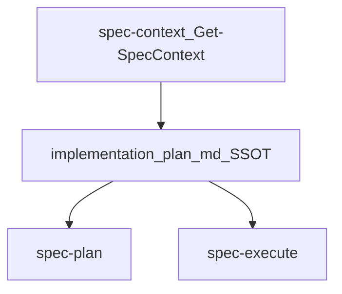

# 实现阶段流程（I1 计划 / I2 执行）

## 1. 背景与目标（对齐 `design/aisdlc.md`）

本方案用于 **Spec 级** 的“实现阶段”提效：在遵循“双层 SSOT + Spec as Code + 渐进式披露”的前提下，用 **可复用的实现 SOP** 把需求稳定推进到“可直接执行的实现计划（含任务清单与状态）”，并以分批执行与检查点汇报完成交付闭环。

**结论**：
- **I1 实现计划为必做**：产出 `{FEATURE_DIR}/implementation/plan.md`，并将其作为**唯一执行清单与状态 SSOT**（包含任务 `- [ ]/- [x]`、每步命令、期望输出、提交点与审计信息）。
- **I2 执行为必做**：以 `{FEATURE_DIR}/implementation/plan.md` 为输入，按批次执行并在检查点汇报；阻塞即停、不得脑补。
- 本阶段 **不包含** verification / release 的正式产物（对应阶段各自产出）；但实现计划中的每个任务必须声明其最小验证方式。

---

## 2. 产物落盘与“渐进式披露”读取顺序

### 2.1 建议落盘结构（需求级 Spec Pack）

对齐 `design/aisdlc.md` 中的需求级目录（示例）：

```text
.aisdlc/specs/<DEMAND-ID>/
  index.md
  requirements/
    ...                   # 已完成的需求分析产物
  design/
    ...                   # 已完成的设计产物
  implementation/
    plan.md               # I1 实现计划（必做；唯一执行清单与状态 SSOT）
```

> 说明：本 SOP 将“任务分解”内嵌进 `implementation/plan.md`（以写计划的方式直接写到可执行），因此 `implementation/tasks.md` 不再作为门禁必做产物。

### 2.2 Agent 读取顺序（渐进式披露）

- **必读（项目级，强制，对齐上下文注入协议）**：
  - `project/memory/*`（业务/技术/结构/术语）
  - 受影响模块的 `project/components/{module}.md` 的 API/Data 契约段落 + Evidence 入口（从 `requirements/solution.md#impact-analysis` 获取受影响模块清单）
  - 相关 ADR（从影响分析获取）
  - `.gitmodules`（如存在；用于识别可参与实现的 submodule 静态清单与路径）
  - 读取失败时标注 `CONTEXT GAP`
- **按需（需求级）**：仅在明确处理某个 `<DEMAND-ID>` 时读取该需求的：
  - **影响分析（必读）**：`specs/{id}/requirements/solution.md#impact-analysis`（R1.5 产出，获取受影响模块与不变量）
  - **需求路径**：`requirements/*`（包含 `solution.md` 或 `prd.md`）
  - **设计路径**：`design/*`（包含 `design.md` 或 `solution.md`）
- **实现阶段 SSOT**：`implementation/plan.md`（唯一执行清单与状态来源）
- **回写（入库）**：每个模块独立产出一个文件，保持可替换与可审计

### 2.3 上下文自动识别机制

对齐 `design/aisdlc_spec_init.md` 中的“上下文自动识别机制”要求，所有 spec 级命令在执行前必须先获取当前 spec 相关上下文信息：

- 调用脚本函数 `Get-SpecContext`（位于 `skills/spec-context/scripts/spec-common.ps1`）
- 获取 `REPO_ROOT`、`CURRENT_BRANCH`、`FEATURE_DIR`、`SPEC_NUMBER`、`SHORT_NAME`
- 若仓库存在 `.gitmodules`，额外输出 submodule 状态快照（如 `SUBMODULE_SET_JSON`），用于实现阶段校验受影响子仓的分支/HEAD/脏工作区状态
- 基于 `FEATURE_DIR` 自动定位输入/输出路径，例如：
  - `implementation/plan.md` → `{FEATURE_DIR}/implementation/plan.md`

> 约束：`FEATURE_DIR` 仍然只从根项目分支解析；submodule 只提供实现期代码工作区状态，不承载 Spec 文档。

---

## 3. 实现SOP总览（统一流程）

**流程**：`I1 实现计划（必做） → I2 执行（必做）`

**最短路径（小需求）**：

`I1 实现计划 → I2 执行`

说明：
- **最小输入**：`requirements/solution.md` 或 `requirements/prd.md`（至少其一）
- **门禁要求**：若输入不足，必须在 `plan.md` 中标注 “NEEDS CLARIFICATION”，并阻断进入 I2
- **路由权威**：本阶段的“下一步”由 `using-aisdlc` 作为唯一路由器判定；I1/I2 是 worker skill，完成后统一回到 `using-aisdlc` 重新路由（通常 I1→I2→Finish）。

---

## 3.1 技能职责边界（I1/I2 为 worker skill）

实现阶段 SOP 以“技能”为执行单元；技能定义文件作为执行约束的 SSOT。本文档在此只明确 I1/I2 的职责边界与链路关系，避免在多个技能里各自发明“下一步路由”口径。

### 3.1.1 技能清单

- **`spec-plan`**：生成 `{FEATURE_DIR}/implementation/plan.md`（唯一 SSOT；包含任务清单与状态）。
  - **逆向来源（仅参考）**：`skills/writing-plans/SKILL.md`
- **`spec-execute`**：按 `{FEATURE_DIR}/implementation/plan.md` 分批执行并在检查点汇报；阻塞即停。
  - **逆向来源（仅参考）**：`skills/executing-plans/SKILL.md`

### 3.1.2 技能链路（概念图）



---

## 4. 执行步骤提示词（结构化要求）

以下步骤结构用于**具体模块的执行描述**，强调“门禁”和“澄清项”：

1. **设置（Setup）**：
   - 读取当前需求上下文（分支/目录），确定 `<DEMAND-ID>` 与 `specs/<DEMAND-ID>/implementation/` 目录
   - 必须先用 `spec-context` 运行 `Get-SpecContext` 并回显 `FEATURE_DIR=...`；失败即停止（禁止猜路径）
2. **加载上下文（Load context）**：
   - 读取关键产物（按需最少读取）：
     - **需求路径**：`requirements/solution.md`、`requirements/prd.md`
     - **设计路径**：`design/design.md`（如存在）
   - 以及项目级 `memory/`、`components/`、`adr/`
3. **执行工作流（Execute workflow）**：
   - 依据模块模板执行，**将未知项标记为 “NEEDS CLARIFICATION”**
   - **门禁未通过则报错**（ERROR），不得落盘下一阶段产物
4. **停止并报告（Stop and report）**：
   - 报告执行到哪一阶段、产物路径与未解决澄清项

---

## 5. 模块 I1：实现计划（必做）

### 5.1 目标

把需求/设计转化为**可直接执行的实现计划（SSOT）**：除范围/里程碑/依赖/风险/验收外，还必须包含“任务清单（checkbox）+ 每任务可执行步骤（含命令与期望输出）+ 提交点 + 审计信息”，以便后续可按批次无歧义执行。

### 5.2 输入

- **需求路径**：`requirements/solution.md` / `requirements/prd.md`
- **影响分析（必读）**：`{FEATURE_DIR}/requirements/solution.md#impact-analysis`（R1.5 产出），获取受影响模块清单、需遵守的不变量、相关 ADR
- **设计路径**：`design/design.md`（如存在；含"与现有系统的对齐"声明）
- **项目级资源（强制，对齐上下文注入协议）**：
  - `project/memory/*`（业务/技术/结构/术语）
  - 受影响模块的 `project/components/{module}.md`（API/Data 契约段落 + Evidence 入口 + 状态机/领域事件）
  - 相关 ADR 全文
  - 跨模块依赖关系（从 `components/index.md` 的依赖关系图获取）
  - `.gitmodules`（如存在；用于建立“受影响子仓 = 哪些 submodule 路径”的静态事实）

### 5.3 输出（落盘到 `{FEATURE_DIR}/implementation/plan.md`；唯一 SSOT）

#### 5.3.1 `plan.md` 头部（必须）

> 下面是占位符技能 `spec-plan` 对 `plan.md` 的最小头部结构要求（参考 `writing-plans` 的思路，但输出位置改为 Spec Pack）。

```markdown
# [需求名] 实现计划（SSOT）

> **必需技能：** `spec-execute`（按批次执行本计划）
> **上下文门禁：** 必须先用 `spec-context` 定位 `{FEATURE_DIR}`，失败即停止

**目标：** [一句话描述要交付什么]
**范围：** In / Out
**架构：** [2–3 句方法说明 + 关键约束]
**验收口径：** [引用 requirements/solution.md 或 requirements/prd.md 的 AC/验收点]
**影响范围：** [引用 requirements/solution.md#impact-analysis 的受影响模块清单]
**需遵守的不变量：** [从影响分析提取的关键 API/Data 契约不变量]
**子仓范围：** [引用 `.gitmodules` + `impact-analysis`，列出本次需求涉及的 submodule；无则写“无”]

---
```

#### 5.3.2 计划正文（必须）

- **TL;DR**：一句话概括计划目标与范围
- **范围与边界**：In/Out（对齐需求与设计）
- **影响范围与约束（基于 R1.5 影响分析，必填）**：
  - 受影响模块清单及影响类型（引用 `requirements/solution.md#impact-analysis`）
  - 需遵守的 API/Data 契约不变量（逐条列出，标注来源模块）
  - 需遵守的状态机/领域事件约束（如涉及）
  - 跨模块影响与协调事项
- **代码工作区清单（必填，若有 submodule）**：
  - 本次需求涉及的 submodule（从 `.gitmodules` 中引用路径）
  - 每个子仓是否 `required`
  - 是否要求与根项目保持同名 Spec 分支
  - 若存在例外，记录 `exception_reason`
- **里程碑与节奏**：阶段拆分、时间预估、交付物清单
- **依赖与资源**：外部系统/团队/权限/环境/数据依赖
- **风险与验证**：风险清单、验证方式、Owner
- **验收口径**：对应 PRD/方案的关键 AC 与验收人
- **待确认项**：统一标注为 “NEEDS CLARIFICATION”（未消除前不得进入 I2）

#### 5.3.3 任务清单（必须；SSOT）

`plan.md` 内必须包含一个“可勾选”的任务清单，作为唯一的执行清单与状态来源（`- [ ]/- [x]`）。每个任务必须按 2–5 分钟动作粒度拆成可执行步骤，强调：**TDD、DRY、YAGNI、频繁提交**。

任务模板（示例骨架）：

```markdown
## 任务清单（SSOT）

### Task T1: [任务标题]

- [ ] **状态**：未开始 / 进行中 / 完成 / 阻塞（阻塞必须写明取证路径）

**代码仓范围：**
- 根项目：`<root repo path or module>`
- 子仓：`<submodule path>`（`required=true|false`，默认分支=`{CURRENT_BRANCH}`）

**文件：**
- 创建：`exact/path/to/new.file`
- 修改：`exact/path/to/existing.file`（可选：精确到段落/函数）
- 测试：`tests/exact/path/to/test.file`（如适用）

**验收点：**
- [可验证条件 1]
- [可验证条件 2]

**步骤 1：写失败测试（如适用）**
- Run: `[精确命令]`
- Expected: FAIL（写出期望看到的关键失败信号）

**步骤 2：写最少实现**
- 修改点：`path/to/file`

**步骤 3：运行验证**
- Run: `[精确命令]`
- Expected: PASS（写出期望看到的关键通过信号）

**步骤 4：提交（频繁提交；commit message 必须中文）**
- Commit message: `[一句话说明 why]`
- 审计信息：
  - repo: `root`
    branch: `<CURRENT_BRANCH>`
    commit: `<TBD>`
    pr: `<TBD>`
    changed_files: `<TBD>`
  - repo: `<submodule path>`（如适用）
    branch: `<CURRENT_BRANCH>`
    commit: `<TBD>`
    pr: `<TBD>`
    changed_files: `<TBD>`
```

### 5.4 门禁（I1-DoD）

- 计划范围与 `requirements/*`、`design/*` **一致**
- 里程碑明确且可验收（每一项有对应产物或可验证标准）
- 依赖与风险已列出，并有最小验证/缓解动作
- 关键验收口径可追溯（至少引用 `prd.md` 或 `solution.md`）
- **影响范围与约束已注入**：`plan.md` 包含"影响范围与约束"段落，受影响模块与需遵守的不变量已从 `requirements/solution.md#impact-analysis` 提取并逐条列出
- 若 `.gitmodules` 存在且影响分析命中子仓：`plan.md` 已列出受影响子仓、`required` 标记、默认同名分支要求与例外原因
- `plan.md` 内存在“任务清单（SSOT）”，且每个任务包含：文件路径、验收点、最小验证方式、提交点与审计信息
- 任何不确定项均标注为 “NEEDS CLARIFICATION”，且未消除前不得进入 I2

---

## 6. 模块 I2：执行（必做）

### 6.1 目标

将 `{FEATURE_DIR}/implementation/plan.md` 中定义的任务按批次执行，并在每批之间设置审查检查点；遇到阻塞立即停止并提出澄清，而不是猜测推进。

### 6.2 输入

- `{FEATURE_DIR}/implementation/plan.md`（必须；SSOT，含"影响范围与约束"段落）
- `requirements/*`、`design/*`（按 `plan.md` 中引用路径按需读取）
- `{FEATURE_DIR}/requirements/solution.md#impact-analysis`（R1.5 产出，按需回查受影响模块与不变量）
- 项目级受影响模块的 `project/components/{module}.md`（API/Data 契约段落，**只读**，用于实现时校验不变量合规）
- `.gitmodules`（如存在；用于识别计划中声明的子仓路径是否真实存在）
- `spec-context` 返回的 submodule 状态快照（如存在；用于校验分支一致性、detached HEAD、脏工作区）

### 6.3 输出（执行过程回写；以 `plan.md` 为唯一状态来源）

- **代码与配置变更**：在仓库中完成实现（按 `plan.md` 每任务指明的路径/交付物）。
- **状态回写（唯一）**：更新 `{FEATURE_DIR}/implementation/plan.md` 中对应任务：
  - 将已完成任务从 `- [ ]` 标记为 `- [x]`
  - 补充最小可审计信息：按 repo 回写 `branch` / `commit` / `pr` / `changed_files` / 关键验证结果
  - 阻塞任务必须写清：缺什么、如何补齐、向谁取证/从哪里取证
- **决策与契约草拟（Spec 内落盘，禁止直接更新 project/）**（如执行中产生）：
  - **ADR 草案**：优先记录在 `{FEATURE_DIR}/design/design.md` 的“决策/权衡”段落；如需独立文件，可新增 `{FEATURE_DIR}/design/adr/` 下的 ADR 草案（仅需求级资产）
  - **契约草案**：在 `{FEATURE_DIR}/design/` 内草拟/更新（需求级资产；可用 `design/contract-delta.md` 或在 `design/design.md` 中记录契约差量与证据入口）
  - **Merge-back 待办（仅记录，不在本阶段执行）**：在 `plan.md` 中追加“Merge-back 待办清单”小节，记录需要晋升的 ADR/契约/运维/NFR 变更与证据入口；后续由独立的 Merge-back 流程处理（见 `design/aisdlc.md`）

> 说明：本 SOP 不强制新增额外执行日志文件；如需要更细审计，可在 `implementation/` 下增补 `execution-log.md`，但 `plan.md` 仍是唯一的执行清单与状态来源。

### 6.4 执行节奏（批次 + 检查点；对应占位符技能 `spec-execute`）

1. **加载并严格审查计划（Review）**
   - 读取 `{FEATURE_DIR}/implementation/plan.md`
   - 识别计划缺陷：不清晰命令/缺失验证/越界范围/缺失依赖/存在 NEEDS CLARIFICATION
   - 若 `.gitmodules` 存在且 `plan.md` 声明涉及子仓：检查这些子仓是否已创建与根项目同名的 Spec 分支；若分支不一致、处于 detached HEAD、或存在未声明例外，**开始前先停止并报告**
   - 若存在关键疑虑：**开始前先停止并报告**（不要猜测执行）

2. **按批次执行（Batch execute）**
   - 默认：每批执行 **前 3 个未完成任务**（可根据风险与依赖调整）
   - 对每个任务严格按其步骤执行：
     - 前置检查（依赖/权限/环境/输入是否满足）
     - 实施变更
     - 运行该任务声明的最小验证，并记录关键输出
     - 回写状态到 `plan.md`（checkbox + 审计信息）

3. **批次检查点报告（Report checkpoint）**
   - 每批完成后必须汇报：已完成任务、验证结果摘要、未完成任务、阻塞项清单
   - **等待反馈**后再进入下一批

4. **遇阻塞即停（Stop on block）**
   - 立即停止并报告的情况：缺失依赖、验证反复失败、指令不清、计划存在关键缺陷、出现 NEEDS CLARIFICATION 阻塞
   - 原则：**寻求澄清，而非脑补**

### 6.5 门禁（I2-DoD）

- `plan.md` 中所有“计划内任务”已处理：
  - 能完成的已标记为 `- [x]` 且包含最小审计信息
  - 因澄清阻塞无法继续的，必须在任务处写明阻塞原因与取证路径（不得静默跳过）
- 产出与 `plan.md` 的范围/里程碑一致，无越界实现
- 若 `plan.md` 声明存在 `required` 子仓：这些子仓在执行时已与根项目保持同名 Spec 分支，或例外已显式留痕
- 若产生关键决策/契约变更：已在 `{FEATURE_DIR}` 内完成草拟，并在 `plan.md` 的“Merge-back 待办清单”中列入晋升清单与证据入口（Spec 阶段不直接更新 `project/*`）

## 7. 追溯与回写提示

- `{FEATURE_DIR}/implementation/plan.md` 必须引用对应 `requirements/*` 与 `design/*`（保持可追溯）
- 状态回写以 `plan.md` 为唯一来源（checkbox + 审计信息）；
- 涉及 submodule 时，审计信息必须保留 repo 维度（根项目 / 子仓路径 / 分支 / commit / pr / changed_files）
- 实现过程中产生的关键决策/契约变更：**仅在 Spec 目录内落盘草案**；Merge-back 待办与证据入口记录在 `plan.md` 中，后续在独立的 Merge-back 阶段晋升/同步到 `project/adr/` 与对应 `project/components/{module}.md` 的契约段落
- 建议在 PR/提交信息中回链到任务 ID 与 Spec 产物路径（例如：`specs/<DEMAND-ID>/implementation/plan.md#Task-T1`）
