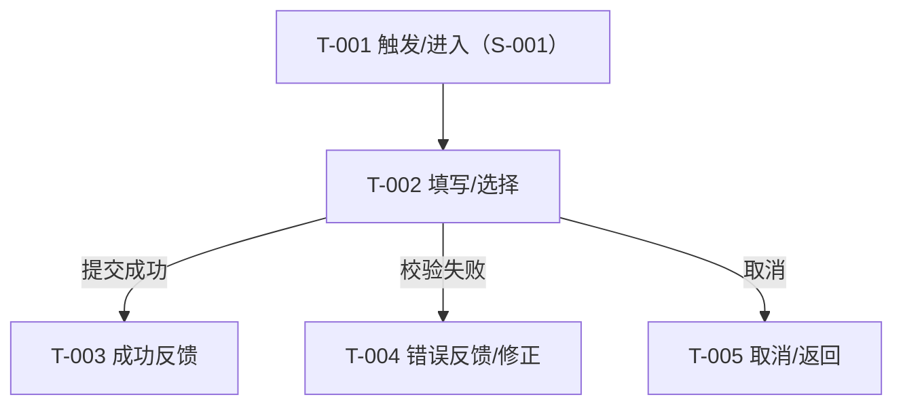

> 目的：把 `requirements/prd.md` 的核心场景/规则/AC，转写为可走查、可评审、可验证的交互说明，消除实现与验收歧义（不做视觉稿）。
>
> 规则：结论优先；只写会影响实现/验收的最小信息；本文档中不出现“待确认问题”清单——所有不确定性统一引用 PRD/solution 的“验证清单”（Owner/截止/动作明确）。

## 0. 基本信息

- 需求标识（分支 / ID）：【必填】
- 作者 / 参与评审：【必填】
- 状态：draft / reviewing / approved
- 最后更新：YYYY-MM-DD
-（可选）Figma 链接入口：<如有则填写；无则写“无”>

---

## 1. 场景清单（与 PRD 对齐，必填）

| 场景编号 | 场景标题（用户视角） | 成功标准（1–3 条） | 任务流节点（T-xxx…） | 页面链路摘要（P-xxx → …） | PRD 对应 AC |
|---|---|---|---|---|---|
| S-001 |  |  | T-… | P-… → P-… | AC-… |
| S-002（可选） |  |  |  |  |  |

---

## 2. 端到端任务流（必填）

> 编号建议：任务流节点 T-001…；页面 P-001…；弹窗 D-001…；抽屉 W-001…（如需单独标识提示/反馈，可另用 F-001…）。



---

## 3. 页面/弹窗清单（必填）

| Node ID | 类型（P/D/W） | 名称/目的 | 入口（从哪里来） | 覆盖任务流节点（T-xxx…） | 覆盖场景 | 备注 |
|---|---|---|---|---|---|---|
| P-001 | P |  |  | T-… | S-001 |  |
| D-001（可选） | D |  |  |  |  |  |

---

## 4. 页面说明（逐页，必填）

> 规则：每个页面/节点一节；必须包含入口、ASCII 线框、状态、跳转；高风险/不可逆操作必须写风险提示与二次确认策略（不确定则写入验证清单并引用编号）。

### 4.1 P-001 <页面名称>

#### 4.1.1 入口与目的

- **ID**：P-001
- **页面目的**：
- **入口**：<从哪个页面/哪个操作进入；引用上游 Node ID>
- **前置条件**：<权限/数据/状态；未知写入 PRD/solution 的验证清单并引用编号>
- **涉及场景**：S-xxx…

#### 4.1.2 ASCII 线框（必填）

> 强制约束：必须使用**纯 ASCII 字符画**（如 `+ - |` 等），不要用表格来画线框，以保证在任何环境下呈现一致。
>
> 直观优先：线框优先表达“页面分区/字段/关键动作/反馈位置（错误提示、toast、banner 等）”，避免在正文重复罗列同样信息。

```text
P-001 <页面名称>
+--------------------------------------------------------------------+
| <页面标题>                                                         |
+--------------------------------------------------------------------+
| <区域/模块 A>                                                      |
| 字段A: [______________]  <字段下方错误提示位置>                    |
| 字段B: [ v ]                                                      |
| 提示: <页面级提示条/banner/toast 的出现位置与触发时机（简写）>      |
|                                                                    |
| <区域/模块 B（列表/明细，如有）>                                   |
| 列1 | 列2 | 列3 | 操作                                             |
| A   | B   | C   | 查看 删除                                        |
|                                                                    |
| 操作: [取消] [提交/保存/生成...]                                   |
+--------------------------------------------------------------------+
```

#### 4.1.3 关键状态与反馈（至少：正常/加载/空/错/无权限）

| 状态 | 触发条件 | 界面要点（展示/可操作性/提示） | 恢复路径（重试/返回/保留输入等） |
|---|---|---|---|
| 正常 |  |  |  |
| 加载 |  |  |  |
| 空 |  |  |  |
| 错误（网络/服务端/业务校验） |  |  |  |
| 无权限（不可见/只读/禁用） |  |  |  |

#### 4.1.4 关键校验与错误处理（只写会影响 AC 的）

- 校验-1：<条件 + 规则 + 反馈位置/文案要点>
- 校验-2：

#### 4.1.5 跳转与交互（成功/失败/取消/关闭/返回）

- **成功后**：<跳转到哪个页面/刷新哪个区域/展示什么反馈>
- **失败后**：<是否可重试/是否保留输入/是否落草稿；不确定写入验证清单并引用编号>
- **取消/关闭**：<回到哪里；是否需要二次确认>
- **返回**：<返回策略>

---

### 4.2 P-002 <页面名称>

（按 P-001 模板重复）

---

## 5. AC → 交互节点映射（如 PRD 存在则必须）

| AC-ID / 描述 | 场景 | 任务流节点（T-xxx…） | 页面/节点（P/D/W-xxx） | 验证点（状态/文案/按钮可用性/跳转结果） |
|---|---|---|---|---|
| AC-001 | S-001 | T-… | P-001 / D-001 |  |
| AC-002 | S-002 |  |  |  |

> 若 PRD 不存在或 AC 缺失：请在本节开头标注“AC 来源不足”，并说明影响与回流建议（建议补齐 PRD AC）。

---

## 6. 走查/验证脚本（必须）

### 6.1 覆盖的验证清单条目（引用 `solution.md/prd.md`）

- V-001：<引用风险/假设>（验证方式/信号见原文）
- V-002：

### 6.2 任务脚本（按场景）

> 模板：任务目标 → 关键步骤 → 成功标准 → 观察点/记录项

**任务-1（S-001）**

- 任务目标：
- 关键步骤（引用 T-xxx/P-xxx）：
- 成功标准：
- 观察点/记录项：

**任务-2（S-002）**

（按上面模板）

### 6.3 记录方式（问题清单模板）

| 问题 | 严重度（S1/S2/S3） | 复现步骤 | 影响范围（场景/页面/AC） | 建议修复方向 |
|---|---|---|---|---|
|  |  |  |  |  |

### 6.4 结论与回流

- 结论摘要：
- 需要回流更新的文件：
  - `requirements/solution.md`（原因：边界/方案/风险与验证项变化）
  - `requirements/prd.md`（原因：AC/规则/范围口径需补齐）
  - `requirements/prototype.md`（原因：交互/页面/状态需调整）

---

## 7. 追溯链接（Evidence & References）

- PRD：`requirements/prd.md`（<章节/场景/AC 索引>）
- Solution：`requirements/solution.md`（<结论/验证清单入口>）
- Raw：`requirements/raw.md`（<证据入口>）
- 术语与口径：`project/memory/glossary.md`（无则标注“无”）

---

## 8. R3-DoD 自检（完成标准）

- [ ] 交互内容与 PRD 的场景/规则/AC 一一对应
- [ ] 任务流、节点清单与页面清单一致（可追溯、可定位）
- [ ] 每个页面至少包含：入口、ASCII 线框、状态、跳转
- [ ] 关键状态覆盖完整（至少：正常/加载/空/错/无权限；提交类交互包含成功/失败反馈与恢复路径）
- [ ] 高风险/不可逆操作包含风险提示与二次确认策略（不确定项已进入 PRD/solution 的验证清单并在文中引用编号）
- [ ] 与 PRD 的 AC 可追溯（能指出“哪个页面/哪个状态支持哪条 AC”；PRD 缺失则明确标注影响并提出回流）
- [ ] 至少包含一份“走查/验证脚本”章节（含任务脚本与回流指引）

