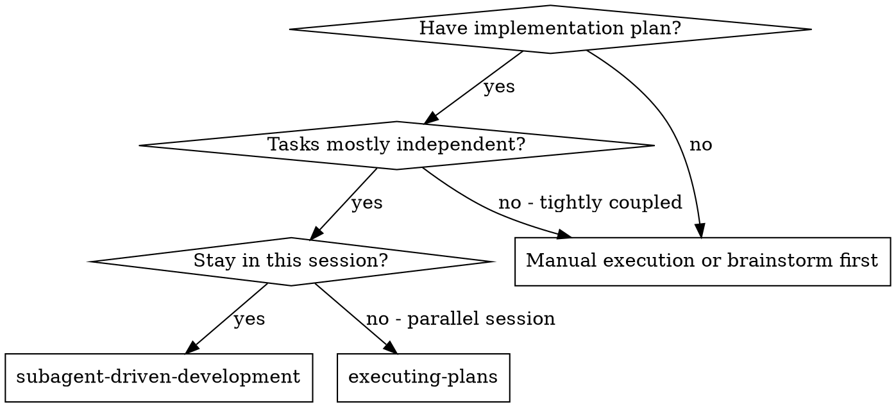
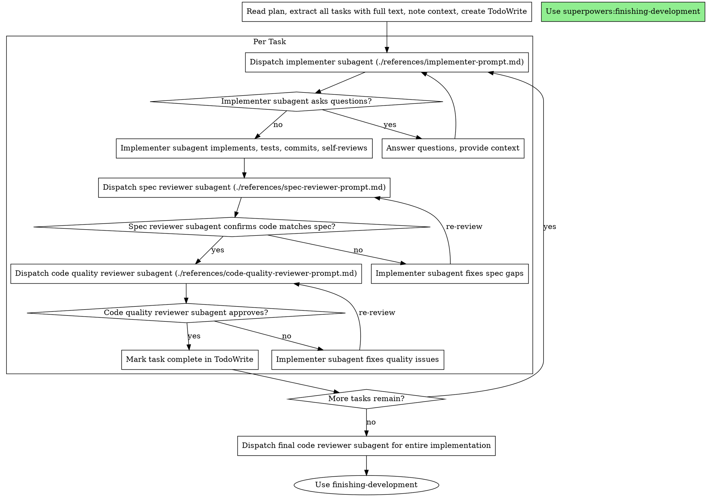

# 子智能体驱动开发

通过为每个任务派发新的子智能体来执行计划，每个任务后进行两阶段审查：先规格符合性审查，再代码质量审查。

**核心原则：** 每任务一个新子智能体 + 两阶段审查（先规格后质量）= 高质量、快速迭代

**开始时宣布：**「我正在使用 subagent-driven-development 技能按计划派发子智能体并执行两阶段审查。」

## 何时使用

**与 Executing Plans（并行会话）相比：**
- 同一会话（无上下文切换）
- 每任务一个新子智能体（无上下文污染）
- 每任务后两阶段审查：先规格符合性，再代码质量
- 更快迭代（任务间无人为介入）

## 流程

## 提示模板

- `references/implementer-prompt.md` - 派发实施者子智能体
- `references/spec-reviewer-prompt.md` - 派发规格符合性审查者子智能体
- `references/code-quality-reviewer-prompt.md` - 派发代码质量审查者子智能体

## 优势

**与手动执行相比：**
- 子智能体自然遵循 TDD
- 每任务新上下文（无混淆）
- 并行安全（子智能体互不干扰）
- 子智能体可提问（工作前后及期间）

**与 Executing Plans 相比：**
- 同一会话（无交接）
- 连续进展（无等待）
- 自动审查检查点

**效率提升：**
- 无文件读取开销（控制器提供全文）
- 控制器只提供所需上下文
- 子智能体预先获得完整信息
- 工作开始前暴露问题（而非之后）

**质量门槛：**
- 自审在交接前发现问题
- 两阶段审查：规格符合性，再代码质量
- 审查循环确保修复有效
- 规格符合性防止过度/不足实现
- 代码质量确保实现良好

## 红旗

**绝不：**
- 未经用户明确同意在 main/master 分支上开始实施
- 跳过审查（规格符合性或代码质量）
- 带着未修复问题继续
- 并行派发多个实施子智能体（会冲突）
- 让子智能体读取计划文件（改为提供全文）
- 跳过背景设定（子智能体需理解任务所处位置）
- 忽视子智能体问题（在让其继续前回答）
- 在规格符合性上接受「差不多」（规格审查发现问题 = 未完成）
- 跳过审查循环（审查者发现问题 = 实施者修复 = 再次审查）
- 用实施者自审替代实际审查（二者都需要）
- **在规格符合性 ✅ 之前开始代码质量审查**（顺序错误）
- 任一审查有未解决问题时进入下一任务

**若子智能体提问：**
- 清晰完整地回答
- 必要时提供额外上下文
- 不要催促其进入实施

**若审查者发现问题：**
- 实施者（同一子智能体）修复
- 审查者再次审查
- 重复直至通过
- 不要跳过再次审查

**若子智能体任务失败：**
- 派发修复子智能体并给出具体指令
- 不要手动修复（会导致上下文污染）

## 集成

**必需工作流技能：**
- **spec-init** - 必需：开始前设置隔离工作区
- **spec-implementation-plan** - 创建本技能所执行的计划
- **requesting-code-review** - 审查者子智能体的代码审查模板
- **finishing-development** - 所有任务完成后做开发收尾确认

**子智能体应使用：**
- **test-driven-development** - 子智能体对每任务遵循 TDD

**替代工作流：**
- **spec-implementation-execute** - 用于并行会话而非同会话执行
