# using-aisdlc（在 sdlc-dev 中使用 AI SDLC / Spec Pack 流程）

## 概览

这是一个“导航 + 门禁”型 Skill：用于在 sdlc-dev 的 Spec Pack（`{num}-{short-name}`）流程里，**由本 Skill 作为“唯一路由器（Router）”决定下一步要用的 skill**，并用硬门禁防止上下文漂移与写错目录。

**开始时宣布：**「我正在使用 using-aisdlc 技能导航 Spec Pack 流程并执行门禁校验。」

本 Skill 现在同时覆盖两条链路：

- **需求链路（R0–R4）**：`raw.md → solution.md → prd.md → prototype.md → demo/`
- **设计链路（D0–D2，可整体跳过）**：`D0 分流 →（可选）D1 research →（未跳过时）D2 RFC`
- **开发链路（I1–I2 + Finish）**：`solution/prd/design → implementation/plan.md → 执行实现 → finishing-development`

**核心原则：**

- **先上下文，再读写**：凡读写 `{FEATURE_DIR}/requirements/*`、`{FEATURE_DIR}/design/*`、`{FEATURE_DIR}/implementation/*`（或 R4 写 demo）→ 先 `spec-context` 得到 `FEATURE_DIR`（失败就停止）。
- **一个节点 = 一个 skill = 一个落盘产物**：R0/R1/R2/R3/R4 分步执行，禁止“一次性把 PRD+原型+Demo 全做了”。
- **渐进式披露**：先读项目级 `memory/` 与相关契约索引；明确处理某个 Spec 后再读写 `{FEATURE_DIR}/requirements/*`。
- **不确定性不写“待确认问题清单”**：统一进入“验证清单”（Owner/截止/信号/动作）。
- **回流闭环**：R3/R4 的验证发现会回流更新 R1/R2/R3（必要时再做 R4）。
- **实现侧 SSOT**：实现阶段以 `{FEATURE_DIR}/implementation/plan.md` 作为**唯一执行清单与状态 SSOT**（checkbox + 审计信息）；执行状态只回写到 `plan.md`。

## 路由契约（唯一权威：下一步只由 using-aisdlc 判定）

**本仓库 Spec Pack 场景下，“下一步做什么/是否跳过/走哪条链路”的判断，只有 using-aisdlc 有权做出。**  
其它技能（R1/R2/R3/R4/D1/D2/I1/I2/Finish）是 **worker skill**：只负责本阶段门禁 + 产物落盘 + DoD 自检，**不得**：

- 在技能内部“自主分流到下一个技能”（例如“完成后自动进入 X”）
- 在技能内部决定“跳过/不跳过某阶段”的路由结论（最多做防呆校验：不满足前置则停止，并提示回到 using-aisdlc）

**重要补充：Router 必须自动推进并立即执行。**using-aisdlc 作为 Router，**在同一轮对话内**按门禁串联执行：`spec-context → worker skill →（可选）再次路由`。  
只要未命中“硬中断”，Router **禁止**停在“是否继续/要不要执行下一步”的询问上；**路由结论一旦产生，就应立即执行下一步 worker skill**。  
worker skill 仍然不得“自己决定下一步”，但应在结尾提供结构化的产物与状态摘要，方便 Router 判断是否可继续自动推进与执行。

**统一回环输出：**任一 worker skill 完成后，结尾统一输出（两段都要有）：

- 「本阶段产物已落盘。`using-aisdlc` 将在**本轮对话内**自动路由并**立即执行**下一步（除非触发硬中断；触发时会停下并输出候选下一步与所需最小输入）。」
- `ROUTER_SUMMARY`（结构化摘要，便于自动路由；建议使用 YAML 形态，字段固定，避免自由文本）：
  - `stage`: 例如 `CTX` / `R1` / `R2` / `D2` / `I1` / `I2` / `Finish`
  - `artifacts`: 产物路径数组（可空）
  - `needs_human_review`: `true|false`（**仅用于软检查点提示**；不应默认导致 Router 中断）
  - `blocked`: `true|false`
  - `block_reason`: string（无则空）
  - `notes`: string（可空）

## 自动推进（Auto-Advance）策略（提升体验与效率）

目标：在**不牺牲门禁与 SSOT**的前提下，把“回到 using-aisdlc”从**人工操作**变成**默认自动行为**；只有在确实需要用户介入时才停下。

### 入口预检（Preflight）：`raw.md` 缺失 / 分支不合规 → 自动执行 `spec-init`

> 这是一条**强制路由规则**：只要满足触发条件之一，`using-aisdlc` 必须**立即路由到 `spec-init` 并在本轮对话内执行**（除非缺少最小输入，需先收集后立刻执行）。

**触发条件（任一命中即触发）：**

- **当前分支不满足命名规则**：分支名不符合 `{num}-{short-name}`（`num` 三位数字；`short-name` 为 kebab-case，小写字母/数字/连字符）
  - 示例：`main`、`dev`、`feature/xxx`、`spec/xxx` 都视为不合规
- **`requirements/raw.md` 不存在或为空**：无法作为 R1（澄清）输入（通常意味着尚未建包/初始化不完整）

**执行顺序（强制）：**

1. **先做轻量分支校验（不依赖 FEATURE_DIR）**：如果分支不合规 → 直接进入 R0 `spec-init`（不要先跑 `spec-context`）
2. **若分支合规**：再跑 `spec-context` 得到 `FEATURE_DIR=...`，然后检查 `{FEATURE_DIR}/requirements/raw.md` 是否存在且非空；若缺失/为空 → 进入 R0 `spec-init`
3. **路由并执行 `spec-init`**

### 默认行为与触发条件

- **默认行为（优先级最高）**：只要未命中“硬中断”，`using-aisdlc` **应自动推进到下一步**，无需等待用户额外说“继续”。
- **执行要求（强制）**：Router 在输出“下一步（唯一）”后，**必须紧接着执行该 worker skill**（而不是停在对话里等用户确认）。如果执行需要补齐最小输入，则先收集输入，收集到后立即执行。
- **禁止询问**：**严禁**在输出下一步后以「是否继续？」「要执行吗？」等询问结束回复；路由结论产生即执行，不得等待用户确认。
- **额外触发（加强信号）**：
  - 用户明确表达：**“继续 / 下一步 / 按推荐 / 自动推进 / 跑通最短闭环 / 直接带我走流程”**
  - 当前对话意图明确且单向：例如用户说“我要出 PRD/原型/Demo/实现计划/开始实现”，且前置产物齐全
  - 上一步 worker skill 的 `ROUTER_SUMMARY` 标记：`blocked=false`（且未命中硬中断）

### 人工介入策略：硬中断（Hard stop）与软检查点（Soft checkpoint）

本仓库的“硬门禁”仍然存在（尤其是 `spec-context`），但**人工中断应尽可能少**：默认自动推进；只有达到“成本高/分支大/拿不到输入”的阈值才强制停下。

#### 硬中断（必须停止并交给用户）

- **拿不到关键外部输入/上下文**：没有就无法继续且无法用默认值替代
  - 典型：`spec-context` 失败；R4 找不到 `DEMO_PROJECT_ROOT`；worker skill 标记 `blocked=true`
- **存在重大决策分支，且选错代价高**：同时满足“≥2 条都合理”与“错误代价高/难回滚”
  - 典型：是否做数据迁移/是否变更对外契约（API/事件/权限/数据口径）/是否引入新基础设施或跨团队依赖
- **预计任务量超过 1 个工作日**：以实现侧（I2）为主的估算；或需求侧/设计侧产物明显涉及多系统、多模块、长链路联动
  - Router 需要在输出中显式标注“为何判断 >1 天”（以影响面与不确定性为依据即可）
- **涉及不可逆/高风险操作**（即便只是“文档落盘”也可能触发组织流程风险）
  - 典型：删除/废弃 Spec Pack（走 `spec-pack-abandon`）；会导致对外承诺变更或需要强评审的 RFC

#### 软检查点（不中断自动推进，但必须显式提示可评审）

- **权威输入类产物已生成/更新**：`solution.md`（含 `#impact-analysis`）、`prd.md`、`prototype.md`、`design/design.md`、`implementation/plan.md`
  - 行为：**继续自动推进**（若未触发硬中断），同时在对话输出里给出“本轮最小评审点”（例如：本次新增/变更的验收点、影响面、关键假设、默认取舍）
- **存在轻量分流点但默认策略足够安全**：例如“是否补 R2/R3/R4”
  - 行为：按“最短闭环 + 最小风险”默认决策继续推进，并把“为什么这么选”和“如果要走另一条路需要什么”写入验证清单（而不是停下来等确认）

> 例外：如果用户明确要求“按最短闭环直接开发并接受默认决策”，using-aisdlc 可在 D0 依据决策表自动判定是否跳过 design，并自动进入 I1。进入 I2（改代码）的默认策略是：当用户意图已明确包含“开始实现/改代码/交付完成/跑通闭环”时自动进入；若用户意图仅为“产出文档/产出计划”，则停在 I1 并不进入 I2（不做“要不要继续”的询问）。

### 默认自动推进顺序（当可自动推进时）

- **先门禁**：若下一步会触发读写 `{FEATURE_DIR}/...` 或写 demo，则先 `spec-context` 并回显 `FEATURE_DIR=...`（失败即停）
- **输出所选下一步**：在自动执行前，**必须输出**所选下一步的名称（例如：`下一步：spec-product-prd`），便于用户知晓当前执行路径
- **补齐最小缺失输入（如有）**：如果执行该 skill 需要用户输入且无法默认推断，则用最少问题一次性收集；收集到后立即执行
- **再执行**：调用路由出的唯一 worker skill 并完成落盘
- **再路由**：读取 `ROUTER_SUMMARY` 与当前上下文，若未命中硬中断则继续；若命中硬中断则停止并输出：
  - 阻断原因（对应硬中断条目）
  - 需要用户提供的最小输入/最小裁决点
  - **可能的下一步（候选）**：列出 2–5 个下一步步骤与对应 skill 名称（按推荐顺序）

## 路由输入/输出（对话级协议）

- **输入（路由所需最小信息）**：用户意图（想产出什么/想进入哪个阶段）+ 当前 Spec 上下文（必须经 `spec-context` 得到 `FEATURE_DIR/CURRENT_BRANCH/REPO_ROOT`）。
- **决策依据（只认 SSOT 文件与门禁）**：
  - R0：`{FEATURE_DIR}/requirements/raw.md`
  - R1：`{FEATURE_DIR}/requirements/solution.md`（必须含 `## Impact Analysis`，锚点 `#impact-analysis`）
  - R2：`{FEATURE_DIR}/requirements/prd.md`
  - R3：`{FEATURE_DIR}/requirements/prototype.md`
  - D1：`{FEATURE_DIR}/design/research.md`
  - D2：`{FEATURE_DIR}/design/design.md`
  - I1：`{FEATURE_DIR}/implementation/plan.md`
- **输出（唯一“下一步指令”格式）**：
  - 你现在处于：`<阶段>`
  - 下一步（唯一）：`<skill 名称>`（Router **将立即执行**）
  - 必须先过：`spec-context → FEATURE_DIR=...`（以及本 skill 的硬门禁）
  - 将产生：`<落盘产物路径>`

> **当 Router 因硬中断而不自动续跑时**，输出必须追加一段「可能的下一步（候选）」：  
> 例如：`R2: spec-product-prd`、`I1: spec-implementation-plan`、`D1: spec-design-research` 等（仅列 skill 名称 + 一句话适用条件）。

## 何时使用 / 不使用

- **使用时机**
  - 你要开始/继续一个 Spec：生成或更新 `raw.md / solution.md / prd.md / prototype.md / demo`
  - 你要把一个“简单需求”直接推进到开发闭环：`solution.md → plan.md → execute → finishing`
  - 你要决定设计阶段路线：是否跳过 design、是否需要 research、是否需要 RFC（design/design.md）
  - 你不确定“现在该跑哪个 spec-product-* skill”
  - 你不确定“现在该跑 spec-implementation-plan / spec-implementation-execute 还是先补需求输入”
  - 用户在施压时提出：不想跑脚本、直接给你路径、要求你先写再补上下文
- **不要用在**
  - 仅讨论概念、不涉及本仓库 Spec Pack 的落盘文件与目录结构

## 唯一门禁（必须遵守）

**规则：只要任务会读写以下任意内容，就必须先跑 `spec-context` 并回显 `FEATURE_DIR=...`：**

- `{FEATURE_DIR}/requirements/raw.md`
- `{FEATURE_DIR}/requirements/solution.md`
- `{FEATURE_DIR}/requirements/prd.md`
- `{FEATURE_DIR}/requirements/prototype.md`
- `{FEATURE_DIR}/design/*.md`（例如 `design/design.md`、`design/research.md`）
- `{FEATURE_DIR}/implementation/plan.md`
- `{REPO_ROOT}/demo/prototypes/{CURRENT_BRANCH}/...`（R4）

**即使用户口头给了 `FEATURE_DIR` 也不例外。**（基线压测中最常见的违规点：把“用户给的路径”当成可信上下文。）

> 命令书写约定：默认面向 PowerShell；同一行多命令请用 `;` 分隔（不要用 `&&`）。

## 你要的最短闭环（简单需求开发）：raw → solution.md → plan.md → execute → finishing-development

适用前提（满足其一即可）：

- **范围单一、边界清晰**，风险低，不需要额外设计阶段决策文档（可按 `design/aisdlc_spec_design.md` 的 D0 判定跳过 design）
- **验收口径可追溯**：至少能在 `solution.md`（或更完整的 `prd.md`）里写清楚验收点

最短闭环（建议先跑通）：

1. **R0：落盘 raw（如尚未建包）**
   - 用什么：`spec-init`
   - 输出：`{FEATURE_DIR}/requirements/raw.md`
2. **门禁：定位 Spec 上下文**
   - 用什么：`spec-context`
   - 要求：对话中必须回显 `FEATURE_DIR=...`；失败即停止
3. **R1：raw → solution（收敛方案）**
   - 用什么：`spec-product-clarify`
   - 输出：`{FEATURE_DIR}/requirements/solution.md`
   - 产物门禁：`solution.md` 必须包含 `## Impact Analysis`（锚点 `#impact-analysis`），作为后续 D2/I1 的约束输入
   - 兼容说明：用户可能会说 `solutions.md`，但本仓库需求侧 SSOT 以 **`solution.md`（单数）** 为准；不要新建 `solutions.md` 造成双 SSOT
4. **D0：分流判定（是否需要 design 阶段）**
   - 用什么：`using-aisdlc`（本 Skill 负责判定；不落盘或在后续产物中引用分流结论）
   - 结论：跳过 design → I1；不跳过 →（按需）D1/D2
5. **I1：solution/prd/design → plan（写到可执行）**
   - 用什么：`spec-implementation-plan`
   - 输出：`{FEATURE_DIR}/implementation/plan.md`（唯一执行清单与状态 SSOT）
6. **I2：按 plan 分批执行（实现 + 回写状态/审计）**
   - 用什么：`spec-implementation-execute`
   - 规则：执行状态只回写 `implementation/plan.md`；遇到 `NEEDS CLARIFICATION` / 阻塞即停
7. **Finish：开发收尾确认（仅验证，全绿才算完成）**
   - 用什么：`finishing-development`
   - 输出：一份“完成确认报告”（包含实际运行的命令与结果）

## 核心工作流（需求侧 R0 → R4；设计侧 D0 →（可选）D1 →（可选）D2；实现侧 I1 → I2 → Finish）

```dot
digraph aisdlc_flow {
  rankdir=LR;
  node [shape=box];
  "要处理某个需求（Spec）" -> "是否已有合法 spec 分支/Spec Pack？";
  "是否已有合法 spec 分支/Spec Pack？" [shape=diamond];
  "是否已有合法 spec 分支/Spec Pack？" -> "R0: spec-init" [label="否 / 不确定 / raw.md 缺失"];
  "R0: spec-init" -> "运行 spec-context" ;
  "是否已有合法 spec 分支/Spec Pack？" -> "运行 spec-context" [label="是"];
  "运行 spec-context" -> "得到 FEATURE_DIR / CURRENT_BRANCH / REPO_ROOT";
  "得到 FEATURE_DIR / CURRENT_BRANCH / REPO_ROOT" -> "选择需求链路 R1-R4（可选）";
  "得到 FEATURE_DIR / CURRENT_BRANCH / REPO_ROOT" -> "D0: 是否跳过 design？";
  "选择需求链路 R1-R4（可选）" -> "R1: raw->solution (含Impact Analysis)";
  "R1: raw->solution (含Impact Analysis)" -> "R2: solution->prd（可选）";
  "R2: solution->prd（可选）" -> "R3: prd->prototype（可选）";
  "R3: prd->prototype（可选）" -> "R4: prototype->demo（可选）";
  "D0: 是否跳过 design？" [shape=diamond];
  "D0: 是否跳过 design？" -> "I1: spec-implementation-plan" [label="是（跳过）"];
  "D0: 是否跳过 design？" -> "D1: spec-design-research（可选）" [label="否，且需要 research"];
  "D0: 是否跳过 design？" -> "D2: spec-design（RFC）" [label="否，且不需要 research"];
  "D1: spec-design-research（可选）" -> "D2: spec-design（RFC）";
  "R1: raw->solution (含Impact Analysis)" -> "D0: 是否跳过 design？";
  "R2: solution->prd（可选）" -> "D0: 是否跳过 design？";
  "R3: prd->prototype（可选）" -> "D0: 是否跳过 design？";
  "D2: spec-design（RFC）" -> "I1: spec-implementation-plan";
  "I1: spec-implementation-plan" -> "I2: spec-implementation-execute";
  "I2: spec-implementation-execute" -> "Finish: finishing-development";
}
```

## D0/D1/D2 路由规则（using-aisdlc 负责判定）

> 设计阶段口径与细则以 `design/aisdlc_spec_design.md` 为准；这里仅给出可执行的路由决策表。

### D0：是否跳过 design 阶段（只在 using-aisdlc 判定）

- **可考虑跳过（满足其一即可考虑）**：范围单一边界清晰 / 无对外承诺变化（API/事件/权限/数据口径）且无迁移回滚 / 无关键技术不确定性 / 验收口径已足够可追溯
- **默认不跳过（任一命中）**：对外契约/权限/口径变更、数据迁移/回滚、高风险不确定性、多系统/上下游影响面大、团队明确要求出 RFC 评审

结论：

- **跳过** → 路由到 `spec-implementation-plan`（I1），并要求在 `plan.md` 补齐最小决策信息
- **不跳过** → 进入 D1/D2 分流

### D1：是否需要 research（只在 using-aisdlc 判定）

命中任一则需要 D1（路由到 `spec-design-research`）：

- 方案正确性依赖未知事实（若 X 不成立会推倒重来）
- 多方案缺证据支撑取舍
- 对外契约/迁移/安全/性能/一致性存在高风险点需先验证

否则：直接路由到 `spec-design` 产出 D2（RFC）。

### D2：执行 RFC（由 `spec-design` 作为 worker skill 落盘）

当路由到 D2 时，`spec-design` 只负责产出/更新：

- `{FEATURE_DIR}/design/design.md`

并强制消费：`solution.md#impact-analysis` + 受影响模块组件页全文 + 相关 ADR 全文；缺失必须显式 `CONTEXT GAP`。

### R0：初始化新 Spec Pack

- **用什么**：`spec-init`
- **什么时候**：还没有 `{num}-{short-name}` 分支与 `.aisdlc/specs/{num}-{short-name}/` 目录
- **输出**：`{FEATURE_DIR}/requirements/raw.md`（UTF-8 with BOM）
- **完成后**：`using-aisdlc` 将自动路由并**立即执行**下一步（通常先 `spec-context`，再进入 R1；除非触发硬中断）

### R1：澄清 + 方案决策（raw → solution）

- **用什么**：`spec-product-clarify`
- **前置输入**：`spec-context` 成功；`{FEATURE_DIR}/requirements/raw.md` 存在且非空
- **关键纪律**：一次一问（优先选择题）+ 增量回写 `raw.md/## 澄清记录` + 停止机制
- **输出**：`{FEATURE_DIR}/requirements/solution.md`
- **产物门禁**：`solution.md` 必须包含 `## Impact Analysis`（`#impact-analysis`），且可被 D2/I1/I2 直接引用
- **完成后**：`using-aisdlc` 将自动路由并**立即执行**下一步（R2/R3/R4/D0→I1/D1/D2 等由 Router 统一判定；除非触发硬中断）

### R2：PRD（solution → prd，可选）

- **用什么**：`spec-product-prd`
- **前置输入**：`{FEATURE_DIR}/requirements/solution.md` 必须存在
- **输出**：`{FEATURE_DIR}/requirements/prd.md`
- **完成后**：`using-aisdlc` 将自动路由并**立即执行**下一步（除非触发硬中断）

### R3：原型（prd → prototype，可选）

- **用什么**：`spec-product-prototype`
- **前置输入**：`{FEATURE_DIR}/requirements/prd.md` 必须存在
- **输出**：`{FEATURE_DIR}/requirements/prototype.md`
- **完成后**：`using-aisdlc` 将自动路由并**立即执行**下一步（按需进入 R4；发现问题回流 R1/R2/R3；除非触发硬中断）

### R4：可交互 Demo（prototype → demo，可选）

- **用什么**：`spec-product-demo`
- **前置输入**：`{FEATURE_DIR}/requirements/prototype.md` 必须存在；Demo 工程根目录可定位（找不到就停止并要 `DEMO_PROJECT_ROOT`）
- **输出**：默认 `{REPO_ROOT}/demo/prototypes/{CURRENT_BRANCH}/`
- **完成后**：`using-aisdlc` 将自动路由并**立即执行**下一步（运行走查；发现问题按需回流更新 R1/R2/R3/R4；除非触发硬中断）

### D1：research（可选）

- **用什么**：`spec-design-research`
- **前置输入**：`requirements/solution.md` 已存在且可追溯；（如已存在）`design/research.md` 可增量更新
- **输出**：`{FEATURE_DIR}/design/research.md`
- **完成后**：`using-aisdlc` 将自动路由并**立即执行**下一步（路由到 D2 或回到 R1 修输入；除非触发硬中断）

### D2：design（RFC / 决策文档；未跳过时必做）

- **用什么**：`spec-design`
- **前置输入**：必须读取 `solution.md#impact-analysis`，并全文读取受影响模块组件页与相关 ADR（读不到必须写 `CONTEXT GAP`）
- **输出**：`{FEATURE_DIR}/design/design.md`
- **完成后**：`using-aisdlc` 将自动路由并**立即执行**下一步（通常进入 I1；除非触发硬中断）

### I1：实现计划（solution/prd/design → plan.md，必做）

- **用什么**：`spec-implementation-plan`
- **前置输入**：`spec-context` 成功；`{FEATURE_DIR}/requirements/solution.md` 或 `prd.md` 至少其一存在（否则必须在 `plan.md` 标注 `NEEDS CLARIFICATION` 并阻断进入 I2）
- **输出**：`{FEATURE_DIR}/implementation/plan.md`（唯一执行清单与状态 SSOT）
- **完成后**：`using-aisdlc` 将自动路由并**立即执行**下一步（是否进入 I2 由 Router 按用户意图与门禁判定；除非触发硬中断）

### I2：执行（按 plan.md 分批实现并回写，必做）

- **用什么**：`spec-implementation-execute`
- **前置输入**：`{FEATURE_DIR}/implementation/plan.md` 必须存在且可执行；不存在/不可执行则回到 I1
- **输出**：代码与配置变更 + `plan.md` checkbox/审计信息回写（唯一状态来源）
- **完成后**：`using-aisdlc` 将自动路由并**立即执行**下一步（通常进入 Finish；除非触发硬中断）

### Finish：开发收尾确认（仅验证，全绿才算完成）

- **用什么**：`finishing-development`
- **输出**：完成确认报告（实际运行的命令与结果可复现）
- **完成后**：`using-aisdlc` 将自动进行最终路由（通常可结束；本 Skill 不做合并/PR/清理）

## Quick reference（高频速查）

| 你要做什么 | 必须先有 | 执行 skill | 主要产物 |
|---|---|---|---|
| 新需求建包 | 原始需求（文本或文件） | `spec-init` | `requirements/raw.md` |
| 收敛方案（含影响分析） | `raw.md` | `spec-product-clarify` | `requirements/solution.md#impact-analysis` |
| 冻结交付规格 | `solution.md` | `spec-product-prd` | `requirements/prd.md` |
| 消除交互歧义 | `prd.md` | `spec-product-prototype` | `requirements/prototype.md` |
| 高保真走查 | `prototype.md` + 可运行 demo 工程根目录 | `spec-product-demo` | `demo/prototypes/{branch}/` |
| 设计调研（可选） | `solution.md` | `spec-design-research` | `design/research.md` |
| 产出 RFC（未跳过时） | `solution.md#impact-analysis` | `spec-design` | `design/design.md` |
| 写可执行计划（必做） | `solution.md` 或 `prd.md` | `spec-implementation-plan` | `implementation/plan.md` |
| 按计划实现（必做） | `implementation/plan.md` | `spec-implementation-execute` | 代码变更 + `plan.md` 回写 |
| 开发收尾确认（必做） | 代码已实现 + 计划任务已完成 | `finishing-development` | 完成确认报告 |

> 只要会读写 `{FEATURE_DIR}/requirements/*`、`{FEATURE_DIR}/design/*`、`{FEATURE_DIR}/implementation/*`，或 R4 写 demo：先 `spec-context`，失败就停止。

## 红旗清单（出现任一条：停止并纠正）

- 没跑 `spec-context` 就开始读写 `{FEATURE_DIR}/requirements/*`、`{FEATURE_DIR}/design/*`、`{FEATURE_DIR}/implementation/*`（或开始 R4 写 demo）
- 用户口头给了 `FEATURE_DIR`，你就“信了并跳过脚本”
- `spec-context` 报错仍继续（例如 main 分支也要“先写一版”）
- 为了赶进度先生成文档，事后再补上下文/再回头澄清
- 在 R4 找不到可运行 demo 工程根目录时，自行初始化 Vite/Next.js 工程“放你觉得合适的位置”
- 没有 `{FEATURE_DIR}/implementation/plan.md`（或 plan 不可执行）就开始“直接写代码”
- 执行中把状态/审计写到别处（issue/聊天记录/另一个文件），而不是回写 `implementation/plan.md`

## 常见错误（以及怎么修）

- **把“用户给的路径/分支名”当作上下文**：仍然必须 `spec-context` 回显 `FEATURE_DIR=...`；无法执行就停止。
- **先生成再回头澄清/补证据**：先完成 R1 澄清循环（一次一问 + 回写），达到 DoD 后再生成产物。
- **越级执行**：缺 `solution.md` 就写 `prd.md`，缺 `prd.md` 就写 `prototype.md`，缺 `prototype.md` 就做 demo → 一律停止并回到上一步。
- **越级开发**：缺 `implementation/plan.md` 就开始实现 → 回到 I1 写到“可执行 + 可验证 + 可审计”，再进入 I2。

## 常见借口与反制（来自基线压测）

| 借口（压力来源） | 常见违规行为 | 必须的反制动作 |
|---|---|---|
| “我已经把 FEATURE_DIR 告诉你了，别跑脚本” | 接受口头路径并直接写文件 | **仍然必须跑 `spec-context`**；跑不了就停止，只交付“阻断原因 + 需要的输入/下一步” |
| “我很急，先在 main 上写 solution.md” | 跳过门禁、猜目录写入 | `spec-context` 失败 → **停止**；先切到合法 spec 分支或先 `spec-init` |
| “把 PRD/原型/Demo 一次性都做了” | 节点耦合导致漂移、无法回流 | 拆成 R1→R2→R3→R4；每步完成给下一步与 DoD 自检 |
| “别写 plan 了，直接改代码吧” | 跳过 I1、执行不可审计、容易越界 | 先 `spec-implementation-plan` 产出 `implementation/plan.md`（SSOT），再 `spec-implementation-execute` 分批执行与回写 |

## 一个好例子（最短路径的正确开场）

用户：“我要做一个新需求，先出方案（solution.md），我不想自己找目录。”

正确做法（第一轮）：

- 若尚未创建 spec 分支/Spec Pack → 先 `spec-init`（把原始需求落到 `raw.md`）
- 然后执行 `spec-context` 并回显 `FEATURE_DIR=...`
- 进入 R1：对用户只问 **1 个最高杠杆选择题**；回答后增量回写 `raw.md/## 澄清记录`
- DoD 达标或触发停止机制后生成 `solution.md`，并给出下一步：
  - **简单需求要开发**：I1 `spec-implementation-plan` → I2 `spec-implementation-execute` → `finishing-development`
  - **需要更完整规格/原型**：R2/R3/R4（按需）后再进入 I1/I2

