# using-aisdlc（在 sdlc-dev 中使用 AI SDLC / Spec Pack 流程）

## 概览

这是一个“导航 + 门禁”型 Skill：用于在 sdlc-dev 的 Spec Pack（`{num}-{short-name}`）流程里，**选对下一步要用的 skill**，并用硬门禁防止上下文漂移与写错目录。

**核心原则：**

- **先上下文，再读写**：凡读写 `requirements/*.md`（或 R4 写 demo）→ 先 `spec-context` 得到 `FEATURE_DIR`（失败就停止）。
- **一个节点 = 一个 skill = 一个落盘产物**：R0/R1/R2/R3/R4 分步执行，禁止“一次性把 PRD+原型+Demo 全做了”。
- **渐进式披露**：先读项目级 `memory/` 与相关契约索引；明确处理某个 Spec 后再读写 `{FEATURE_DIR}/requirements/*`。
- **不确定性不写“待确认问题清单”**：统一进入“验证清单”（Owner/截止/信号/动作）。
- **回流闭环**：R3/R4 的验证发现会回流更新 R1/R2/R3（必要时再做 R4）。

## 何时使用 / 不使用

- **使用时机**
  - 你要开始/继续一个 Spec：生成或更新 `raw.md / solution.md / prd.md / prototype.md / demo`
  - 你不确定“现在该跑哪个 spec-product-* skill”
  - 用户在施压时提出：不想跑脚本、直接给你路径、要求你先写再补上下文
- **不要用在**
  - 仅讨论概念、不涉及本仓库 Spec Pack 的落盘文件与目录结构

## 唯一门禁（必须遵守）

**规则：只要任务会读写以下任意内容，就必须先跑 `spec-context` 并回显 `FEATURE_DIR=...`：**

- `{FEATURE_DIR}/requirements/raw.md`
- `{FEATURE_DIR}/requirements/solution.md`
- `{FEATURE_DIR}/requirements/prd.md`
- `{FEATURE_DIR}/requirements/prototype.md`
- `{REPO_ROOT}/demo/prototypes/{CURRENT_BRANCH}/...`（R4）

**即使用户口头给了 `FEATURE_DIR` 也不例外。**（基线压测中最常见的违规点：把“用户给的路径”当成可信上下文。）

## 核心工作流（R0 → R4）

```dot
digraph aisdlc_flow {
  rankdir=LR;
  node [shape=box];
  "要处理某个需求（Spec）" -> "是否已有合法 spec 分支/Spec Pack？";
  "是否已有合法 spec 分支/Spec Pack？" [shape=diamond];
  "是否已有合法 spec 分支/Spec Pack？" -> "R0: spec-init" [label="否 / 不确定"];
  "R0: spec-init" -> "运行 spec-context" ;
  "是否已有合法 spec 分支/Spec Pack？" -> "运行 spec-context" [label="是"];
  "运行 spec-context" -> "得到 FEATURE_DIR / CURRENT_BRANCH / REPO_ROOT";
  "得到 FEATURE_DIR / CURRENT_BRANCH / REPO_ROOT" -> "选择 R1-R4 并执行对应 skill";
}
```

### R0：初始化新 Spec Pack

- **用什么**：`spec-init`
- **什么时候**：还没有 `{num}-{short-name}` 分支与 `.aisdlc/specs/{num}-{short-name}/` 目录
- **输出**：`{FEATURE_DIR}/requirements/raw.md`（UTF-8 with BOM）
- **下一步**：`spec-context` → R1

### R1：澄清 + 方案决策（raw → solution）

- **用什么**：`spec-product-clarify`
- **前置输入**：`spec-context` 成功；`{FEATURE_DIR}/requirements/raw.md` 存在且非空
- **关键纪律**：一次一问（优先选择题）+ 增量回写 `raw.md/## 澄清记录` + 停止机制
- **输出**：`{FEATURE_DIR}/requirements/solution.md`
- **下一步**：默认 R2；简单需求可在 `solution.md` 追加 Mini-PRD 后直达 design

### R2：PRD（solution → prd，可选）

- **用什么**：`spec-product-prd`
- **前置输入**：`{FEATURE_DIR}/requirements/solution.md` 必须存在
- **输出**：`{FEATURE_DIR}/requirements/prd.md`
- **下一步**：按需 R3 或直达 design

### R3：原型（prd → prototype，可选）

- **用什么**：`spec-product-prototype`
- **前置输入**：`{FEATURE_DIR}/requirements/prd.md` 必须存在
- **输出**：`{FEATURE_DIR}/requirements/prototype.md`
- **下一步**：原型评审/最小验证；按需 R4；发现问题回流 R1/R2/R3

### R4：可交互 Demo（prototype → demo，可选）

- **用什么**：`spec-product-demo`
- **前置输入**：`{FEATURE_DIR}/requirements/prototype.md` 必须存在；Demo 工程根目录可定位（找不到就停止并要 `DEMO_PROJECT_ROOT`）
- **输出**：默认 `{REPO_ROOT}/demo/prototypes/{CURRENT_BRANCH}/`
- **下一步**：运行走查；发现问题回流更新 R1/R2/R3/R4

## Quick reference（高频速查）

| 你要做什么 | 必须先有 | 执行 skill | 主要产物 |
|---|---|---|---|
| 新需求建包 | 原始需求（文本或文件） | `spec-init` | `requirements/raw.md` |
| 收敛方案 | `raw.md` | `spec-product-clarify` | `requirements/solution.md` |
| 冻结交付规格 | `solution.md` | `spec-product-prd` | `requirements/prd.md` |
| 消除交互歧义 | `prd.md` | `spec-product-prototype` | `requirements/prototype.md` |
| 高保真走查 | `prototype.md` + 可运行 demo 工程根目录 | `spec-product-demo` | `demo/prototypes/{branch}/` |

> 只要会读写 `requirements/*.md` 或 R4 写 demo：先 `spec-context`，失败就停止。

## 红旗清单（出现任一条：停止并纠正）

- 没跑 `spec-context` 就开始读写 `requirements/*.md`
- 用户口头给了 `FEATURE_DIR`，你就“信了并跳过脚本”
- `spec-context` 报错仍继续（例如 main 分支也要“先写一版”）
- 为了赶进度先生成文档，事后再补上下文/再回头澄清
- 在 R4 找不到可运行 demo 工程根目录时，自行初始化 Vite/Next.js 工程“放你觉得合适的位置”

## 常见错误（以及怎么修）

- **把“用户给的路径/分支名”当作上下文**：仍然必须 `spec-context` 回显 `FEATURE_DIR=...`；无法执行就停止。
- **先生成再回头澄清/补证据**：先完成 R1 澄清循环（一次一问 + 回写），达到 DoD 后再生成产物。
- **越级执行**：缺 `solution.md` 就写 `prd.md`，缺 `prd.md` 就写 `prototype.md`，缺 `prototype.md` 就做 demo → 一律停止并回到上一步。

## 常见借口与反制（来自基线压测）

| 借口（压力来源） | 常见违规行为 | 必须的反制动作 |
|---|---|---|
| “我已经把 FEATURE_DIR 告诉你了，别跑脚本” | 接受口头路径并直接写文件 | **仍然必须跑 `spec-context`**；跑不了就停止，只交付“阻断原因 + 需要的输入/下一步” |
| “我很急，先在 main 上写 solution.md” | 跳过门禁、猜目录写入 | `spec-context` 失败 → **停止**；先切到合法 spec 分支或先 `spec-init` |
| “把 PRD/原型/Demo 一次性都做了” | 节点耦合导致漂移、无法回流 | 拆成 R1→R2→R3→R4；每步完成给下一步与 DoD 自检 |

## 一个好例子（最短路径的正确开场）

用户：“我要做一个新需求，先出方案（solution.md），我不想自己找目录。”

正确做法（第一轮）：

- 若尚未创建 spec 分支/Spec Pack → 先 `spec-init`（把原始需求落到 `raw.md`）
- 然后执行 `spec-context` 并回显 `FEATURE_DIR=...`
- 进入 R1：对用户只问 **1 个最高杠杆选择题**；回答后增量回写 `raw.md/## 澄清记录`
- DoD 达标或触发停止机制后生成 `solution.md`，并给出下一步（默认 R2 / 或简单需求直达 design）

